# F1 — Project Scan & Ingest Pipeline

## Happy Path

The scan pipeline entry point is `src-tauri/src/commands/scan.rs:13` (`scan_projects`), a Tauri IPC command that orchestrates the discovery and persistence of all `.planning/` projects configured in the user's scan roots.

1. **Load & normalize roots** (`scan.rs:63,67`): Settings are loaded, and each configured scan root is normalized (expanding `~`, validating it's within home directory).
2. **Discover candidates** (`scan_service.rs:26,45` → `scanner.rs:26`): For each root, a spawned blocking task uses `ignore::WalkBuilder` to recursively traverse the directory tree, respecting `.gitignore` and `.git/exclude` filters. All `.planning/` directories are collected and deduplicated by canonical path.
3. **Parse per-project** (`scan_service.rs:51,111–172`): For each discovered `.planning/` directory, the system:
   - Infers stable project identity from the root folder name (hash-based to handle duplicates).
   - Reads and parses required/optional Markdown files (ROADMAP.md, STATE.md, MILESTONES.md) and JSON config.
   - Recursively scans `phases/` for all `*-PLAN.md` files and parses each one.
   - Constructs a `ProjectSnapshot` struct combining all metadata and file paths.
4. **Persist to SQLite** (`scan_persistence.rs:17` → `store/project_repo.rs:60`): Each parsed snapshot is converted into a row in the `projects` table (upsert semantics), with separate rows in `phase_plans` and `plan_items` tables. All updates are wrapped in a transaction (`store/project_repo.rs:66,165`).
5. **Emit events & return** (`scan_service.rs:32,39,59,73,81,89`): Channel events are sent to the IPC caller at each stage: `Started`, `RootStarted`, `ProjectFound`, `ProjectParsed`/`ProjectParseError`, `Finished`. The caller receives a `ScanSummary` and can trigger a tray refresh.

Non-fatal parse errors (missing optional files, malformed JSON/YAML) are logged but do not fail the whole pipeline; parse issues are recorded in the `projects.parse_error` column and a `scan_log` entry.

## Side Effects

- **Event emission** (via `on_event` callback, `commands/scan.rs:16,18–19`): ScanEvent enums are serialized and sent over Tauri IPC channel at multiple checkpoints.
- **Database writes** (via deadpool_sqlite connection pool, `scan_persistence.rs:35–89`):
  - `upsert_project_snapshot` uses a transaction to atomically insert/update the `projects` row (`store/project_repo.rs:75–127`).
  - `DELETE FROM phase_plans WHERE project_id = ?` removes old phase plans before inserting new ones (`store/project_repo.rs:130–135`).
  - `INSERT INTO phase_plans` for each phase plan in the snapshot (`store/project_repo.rs:137–163`).
  - `replace_plan_items` and `set_plan_completed_at_if_all_checked` populate and update the `plan_items` table (`scan_persistence.rs:40–50`).
  - `append_scan_log` records parse errors in the audit log (`scan_persistence.rs:52–84`).
- **Blocking task spawning** (via `tokio::task::spawn_blocking`, `scan_service.rs:45,56,114`): CPU-bound I/O (directory walking, file parsing) is offloaded to a blocking thread pool to avoid blocking the async executor.
- **Timestamp recording** (`scan_persistence.rs:207–219`): Unix timestamps (seconds and milliseconds) are captured at the time of persistence and stored in `last_scanned_at`, `completed_at`, and `created_at`/`updated_at` fields.
- **Tray notification** (`commands/scan.rs:22`): On successful scan completion, `request_tray_refresh` is called to signal the system tray that project metadata has changed.

## Flowchart

```mermaid
flowchart TD
  entry["scan_projects<br/>src-tauri/src/commands/scan.rs:13"]
  load_settings["load_or_initialize settings<br/>src-tauri/src/commands/scan.rs:63"]
  normalize_roots["normalize_scan_root per root<br/>src-tauri/src/commands/scan.rs:67"]
  scan_roots_main["scan_roots<br/>src-tauri/src/scan_service.rs:26"]
  emit_started["emit ScanEvent::Started<br/>src-tauri/src/scan_service.rs:32"]
  loop_roots["for each root<br/>src-tauri/src/scan_service.rs:38"]
  emit_root_started["emit RootStarted<br/>src-tauri/src/scan_service.rs:39"]
  spawn_block_discover["spawn_blocking<br/>src-tauri/src/scan_service.rs:45"]
  discover_dirs["discover_planning_dirs<br/>src-tauri/src/scanner.rs:26"]
  validate_root["validate_scan_root<br/>src-tauri/src/scan_roots.rs:11"]
  walk_builder["WalkBuilder .gitignore<br/>src-tauri/src/scanner.rs:35"]
  find_planning_dirs["find .planning dirs<br/>src-tauri/src/scanner.rs:53"]
  dedup_candidates["dedupe by path<br/>src-tauri/src/scanner.rs:67"]
  loop_candidates["for each candidate<br/>src-tauri/src/scan_service.rs:51"]
  inc_discovered["discovered_count++<br/>src-tauri/src/scan_service.rs:52"]
  spawn_identity["spawn_blocking<br/>src-tauri/src/scan_service.rs:56"]
  infer_identity["infer_project_identity<br/>src-tauri/src/scan_service.rs:442"]
  emit_project_found["emit ProjectFound<br/>src-tauri/src/scan_service.rs:59"]
  spawn_parse["spawn_blocking<br/>src-tauri/src/scan_service.rs:114"]
  read_parse["read_and_parse_candidate<br/>src-tauri/src/scan_service.rs:111"]
  parse_files["parse_candidate_files<br/>src-tauri/src/scan_service.rs:119"]
  read_roadmap["read ROADMAP.md<br/>src-tauri/src/scan_service.rs:127"]
  parse_roadmap["parse_roadmap<br/>src-tauri/src/parser/roadmap.rs:1"]
  read_state["read STATE.md opt<br/>src-tauri/src/scan_service.rs:149"]
  parse_state["parse_state<br/>src-tauri/src/parser/state.rs:1"]
  read_milestones["read MILESTONES.md opt<br/>src-tauri/src/scan_service.rs:136"]
  parse_milestones["parse_milestones<br/>src-tauri/src/parser/roadmap.rs:1"]
  read_config["read config.json opt<br/>src-tauri/src/scan_service.rs:163"]
  parse_config["parse_config<br/>src-tauri/src/parser/config.rs:1"]
  read_phase_plans["parse_plan_files phases<br/>src-tauri/src/scan_service.rs:172"]
  walk_phases["collect_plan_files_recursive<br/>src-tauri/src/scan_service.rs:256"]
  parse_plans["parse each PLAN.md<br/>src-tauri/src/scan_service.rs:319"]
  parse_plan["parse_plan<br/>src-tauri/src/parser/plan.rs:1"]
  build_snapshot["ProjectSnapshot construction<br/>src-tauri/src/scan_service.rs:223"]
  derive_progress["derive_project_progress<br/>src-tauri/src/scan_service.rs:338"]
  persist_async["persist_project_scan async<br/>src-tauri/src/scan_service.rs:68"]
  get_conn["pool.get SQLite<br/>src-tauri/src/scan_persistence.rs:35"]
  interact_persist["connection.interact<br/>src-tauri/src/scan_persistence.rs:36"]
  convert_snapshot["stored_snapshot convert<br/>src-tauri/src/scan_persistence.rs:92"]
  stored_phase_plans["stored_phase_plans convert<br/>src-tauri/src/scan_persistence.rs:129"]
  upsert_snapshot["upsert_project_snapshot<br/>src-tauri/src/store/project_repo.rs:60"]
  tx_begin["transaction.begin<br/>src-tauri/src/store/project_repo.rs:66"]
  insert_project["INSERT projects<br/>src-tauri/src/store/project_repo.rs:75"]
  delete_phase_plans["DELETE phase_plans<br/>src-tauri/src/store/project_repo.rs:130"]
  insert_phase_plans["INSERT phase_plans<br/>src-tauri/src/store/project_repo.rs:140"]
  tx_commit["transaction.commit<br/>src-tauri/src/store/project_repo.rs:165"]
  persist_plan_items["replace_plan_items<br/>src-tauri/src/scan_persistence.rs:40"]
  append_scan_log["append_scan_log<br/>src-tauri/src/scan_persistence.rs:52"]
  check_errors["check has_errors<br/>src-tauri/src/scan_service.rs:66"]
  emit_error["emit ProjectParseError<br/>src-tauri/src/scan_service.rs:73"]
  inc_error["error_count++<br/>src-tauri/src/scan_service.rs:72"]
  emit_parsed["emit ProjectParsed<br/>src-tauri/src/scan_service.rs:81"]
  inc_parsed["parsed_count++<br/>src-tauri/src/scan_service.rs:80"]
  emit_finished["emit ScanEvent::Finished<br/>src-tauri/src/scan_service.rs:89"]
  return_summary["return ScanSummary<br/>src-tauri/src/scan_service.rs:95"]
  tray_refresh["request_tray_refresh<br/>src-tauri/src/commands/scan.rs:22"]
  cmd_return["return Result<br/>src-tauri/src/commands/scan.rs:23"]

  entry --> load_settings
  load_settings --> normalize_roots
  normalize_roots --> scan_roots_main
  scan_roots_main --> emit_started
  emit_started --> loop_roots
  loop_roots --> emit_root_started
  emit_root_started --> spawn_block_discover
  spawn_block_discover --> discover_dirs
  discover_dirs --> validate_root
  validate_root --> walk_builder
  walk_builder --> find_planning_dirs
  find_planning_dirs --> dedup_candidates
  dedup_candidates --> loop_candidates
  loop_candidates --> inc_discovered
  inc_discovered --> spawn_identity
  spawn_identity --> infer_identity
  infer_identity --> emit_project_found
  emit_project_found --> spawn_parse
  spawn_parse --> read_parse
  read_parse --> parse_files
  parse_files --> read_roadmap
  read_roadmap --> parse_roadmap
  parse_roadmap --> read_state
  read_state --> parse_state
  parse_state --> read_milestones
  read_milestones --> parse_milestones
  parse_milestones --> read_config
  read_config --> parse_config
  parse_config --> read_phase_plans
  read_phase_plans --> walk_phases
  walk_phases --> parse_plans
  parse_plans --> parse_plan
  parse_plan --> build_snapshot
  build_snapshot --> derive_progress
  derive_progress --> persist_async
  persist_async --> get_conn
  get_conn --> interact_persist
  interact_persist --> convert_snapshot
  convert_snapshot --> stored_phase_plans
  stored_phase_plans --> upsert_snapshot
  upsert_snapshot --> tx_begin
  tx_begin --> insert_project
  insert_project --> delete_phase_plans
  delete_phase_plans --> insert_phase_plans
  insert_phase_plans --> tx_commit
  tx_commit --> persist_plan_items
  persist_plan_items --> append_scan_log
  append_scan_log --> check_errors
  check_errors --> emit_error
  emit_error --> inc_error
  check_errors --> emit_parsed
  emit_parsed --> inc_parsed
  inc_error --> loop_candidates
  inc_parsed --> loop_candidates
  loop_candidates --> emit_finished
  emit_finished --> return_summary
  return_summary --> tray_refresh
  tray_refresh --> cmd_return
```

## External Dependencies

- **ignore crate** (`scanner.rs:6`): Directory walking with gitignore support via `WalkBuilder`.
- **deadpool_sqlite** (`scan_service.rs:6`): Connection pooling and async interaction for SQLite.
- **tokio** (`scan_service.rs`): `spawn_blocking` to offload CPU-bound parsing to a thread pool.
- **serde_json** (`scan_persistence.rs:27`): Serialization of `ProjectSnapshot` to BLOB and `ParseIssue` array.
- **Parser modules** (`scan_service.rs:12–20`): `parse_roadmap`, `parse_plan`, `parse_config`, `parse_state` from the `parser` submodule.
- **Session/milestone matcher** (`scan_service.rs:11`): `milestone_names_match` for cross-referencing state milestones against roadmap.
- **Settings module** (`commands/scan.rs:6`): `settings::load_or_initialize` to fetch user-configured scan roots.
- **Tray service** (`commands/scan.rs:8`): `request_tray_refresh` to notify system tray of updates.

## Sources Consulted

- `/Users/smacdonald/homegit/gsd-dashboard/src-tauri/src/commands/scan.rs` (lines 1–98)
- `/Users/smacdonald/homegit/gsd-dashboard/src-tauri/src/scan_service.rs` (lines 1–503)
- `/Users/smacdonald/homegit/gsd-dashboard/src-tauri/src/scanner.rs` (lines 1–111)
- `/Users/smacdonald/homegit/gsd-dashboard/src-tauri/src/scan_roots.rs` (lines 1–60)
- `/Users/smacdonald/homegit/gsd-dashboard/src-tauri/src/scan_persistence.rs` (lines 1–220)
- `/Users/smacdonald/homegit/gsd-dashboard/src-tauri/src/store/project_repo.rs` (lines 1–200+)
- `/Users/smacdonald/homegit/gsd-dashboard/src-tauri/src/events.rs` (lines 30–57)
- `/Users/smacdonald/homegit/gsd-dashboard/src-tauri/src/parser/mod.rs` (lines 1–150)

## Confidence & Gaps

**High confidence**: The entry point, root normalization, directory discovery (via `ignore::WalkBuilder`), per-candidate parsing flow, snapshot construction, and database persistence (upsert + transaction) are well-traced with exact line numbers. The event emission checkpoints are clear.

**Minor gaps**:
- Parser submodule implementations (`parser/{roadmap,plan,config,state}.rs`) are referenced at module level but not fully traced (would require reading 500+ LoC of grammar/parser code).
- Error recovery branches (e.g., partial parse failures leading to `summary.error_count`) are logged but not deeply analyzed for their exact error paths.
- Session rematch step (`rebuild_cache_for_app`, `scan.rs:52–53`) is a separate feature call and not part of the primary `scan_projects` happy path, though it is part of the `rebuild_cache` command.

**Version**: Traced against source tree as of 2026-06-14 from `/Users/smacdonald/homegit/gsd-dashboard` main branch.
