# F2 — Session Telemetry Pipeline

**Scope**: Entry point `index_sessions` (commands/sessions.rs:19) → terminal state (SessionIndexSummary persisted/returned)

**Tracing approach**: Read source files, followed actual code paths through JSONL streaming, incremental byte-offset tracking, project matching, and DB persistence. Every node labeled with `file:line`.

---

## Happy Path

The primary flow from invocation to completion:

1. **IPC Invocation** → `index_sessions(state, on_event)` wraps user-facing call
2. **Delegation** → routes to `index_sessions_for_app()` with callback closure
3. **Root Discovery** → `discover_existing_roots()` finds Claude and Codex session roots on disk
4. **Event Broadcast** → sends `SessionIndexEvent::Started` with root count to UI
5. **Known Projects Load** → queries DB for all project snapshots; builds `ProjectRoot` list (id, root_path)
6. **Pruning Phase** → three cleanup queries:
   - Delete all unmatched sessions (no project_id)
   - Delete orphan index_states (no corresponding session)
   - Delete tokenless Codex index_states (broken data)
7. **Per-Root Loop** → for each discovered root (Claude/.claude/projects, Codex/.codex/sessions):
   - Send `SessionIndexEvent::SourceStarted`
   - Recursively discover all `.jsonl` files under that root
8. **Bounded Parallel Processing** → spawn up to 2 concurrent workers (SESSION_INDEX_WORKER_LIMIT = 2):
   - Queue all discovered files
   - `spawn_until_limit()` maintains active JoinSet
   - Each file assigned to a spawned task running `index_session_file()`
9. **Per-File JSONL Streaming**:
   - Load previous index state from DB (byte offset, file mtime, size)
   - Seek to `last_parsed_byte_offset` (resumable parsing)
   - Open BufReader; read lines until EOF or incomplete final line
10. **Per-Line Parsing**:
    - Trim JSONL newline (LF/CRLF)
    - Deserialize JSON record
    - Dispatch to `parse_claude_record()` or `parse_codex_record()` depending on source
    - Both parsers extract: timestamp, cwd, source_session_id, model, message_count, token usage
    - Accumulate into `SessionParseAccumulator`
11. **Incomplete Line Handling** → if final line lacks newline:
    - Mark as `StreamFileStatus::LivePartial` (still being written)
    - Return early with committed offset; no session persisted
12. **Session Finalization** → after stream EOF:
    - `finalize_accumulator()`: set session ID from source_session_id or file path
    - Return `StreamFileStatus::Complete` with committed offset
13. **Incremental Merge** → if file was re-indexed (previous_offset > 0 AND not reset):
    - Load previous session from DB
    - `merge_incremental_session()`: combine previous + delta (min start, max end, sum tokens, merge message count)
14. **Project Matching** (blocking task):
    - `match_project()` runs in `spawn_blocking()` (filesystem I/O)
    - Try match by cwd against known roots → `attribution_method = "cwd"`
    - Fall back to git worktree detection → `attribution_method = "worktree_cwd"`
    - For Claude source, try encoded path matching → `attribution_method = "claude_path"`
    - If no match: `project_id = None`, `attribution_method = "unmatched"`
15. **DB Persistence** (in connection pool task):
    - Only persist if: committed_offset > previous_offset AND message_count > 0
    - Delete old sessions for this source_path
    - Upsert matched sessions (INSERT ... ON CONFLICT UPDATE)
    - Upsert index state (byte offset, file_size, file_mtime, live_partial flag)
    - Commit transaction
16. **File-Level Event** → send `SessionIndexEvent::FileIndexed` or `SessionIndexEvent::FileIndexError`
17. **Outcome Collection** → await all spawned tasks; collect outcomes in order
18. **Post-Indexing Aggregation**:
    - Load unmatched count from DB
    - Rebuild daily_activity table (last 90 days)
    - Send `SessionIndexEvent::App(DailyActivityUpdated)`
19. **Return Summary** → send `SessionIndexEvent::Finished` with summary counts
20. **Terminal State** → return `SessionIndexSummary` { root_count, files_processed, sessions_persisted, unmatched_count, error_count }

---

## Side Effects

### DB Writes
- **session_index_state** table: INSERT/UPDATE per indexed file with byte offset, file size, mtime, live_partial flag, last error
- **sessions** table: DELETE old by source_path, then INSERT/UPSERT matched sessions
- **daily_activity** table: TRUNCATE/rebuild last 90 days (aggregate by day+project+source)

### File I/O
- **Seek & read** from JSONL files: `File::open()` → `seek(last_parsed_byte_offset)` → `BufReader::read_until(b'\n')`
- **Canonical path resolution** in matcher: `Path::canonicalize()` (blocking)
- **.git worktree detection**: walk parent dirs, read .git file, parse gitdir reference

### Byte-Offset Tracking
- Load `last_parsed_byte_offset` from DB before streaming
- Increment `committed_offset` only after successful record parse
- Persist updated offset back to DB (resumable on file growth)
- Handle file shrinkage: if new file_size < previous_offset, reset offset to 0

### Event Channel Emissions
- `on_event(SessionIndexEvent)` callback fires synchronously after key milestones:
  - `Started` (root count)
  - `SourceStarted` (per root)
  - `FileIndexed` (per successful file)
  - `FileIndexError` (per failed file)
  - `App(DailyActivityUpdated)`
  - `Finished` (summary)

### Parallel Task Spawning
- `tokio::task::spawn()` in active JoinSet (max 2 workers)
- `tokio::task::spawn_blocking()` for:
  - `discover_existing_roots()` (filesystem scan)
  - `discover_jsonl_files()` (recursive directory walk)
  - `stream_session_file()` (BufReader I/O)
  - `match_project()` (canonicalize, git worktree walk)

### Connection Pool Interaction
- `pool.get()` for each async DB operation
- `connection.interact(closure)` runs closure in thread pool
- Transactions: `connection.transaction()` → closure → `.commit()`

---

## Flowchart

```mermaid
flowchart TD
    START["index_sessions<br/>sessions.rs:19"]
    INDEX_FOR_APP["index_sessions_for_app<br/>sessions.rs:30"]
    INDEX_SESSION_ROOTS["index_session_roots<br/>indexer.rs:40"]
    DISCOVER_ROOTS["discover_existing_roots<br/>indexer.rs:146"]
    SEND_STARTED_EVENT["SessionIndexEvent::Started<br/>indexer.rs:46"]
    LOAD_KNOWN_PROJECTS["load_known_project_roots<br/>file_indexer.rs:220"]
    PRUNE_UNMATCHED["prune_existing_unmatched_sessions<br/>indexer.rs:51"]
    PRUNE_ORPHANS["prune_existing_orphan_index_states<br/>indexer.rs:52"]
    PRUNE_TOKENLESS["prune_existing_tokenless_codex_index_states<br/>indexer.rs:53"]
    FOR_EACH_ROOT["for root in roots<br/>indexer.rs:62"]
    SEND_ROOT_STARTED["SessionIndexEvent::SourceStarted<br/>indexer.rs:67"]
    DISCOVER_JSONL["discover_jsonl_files<br/>indexer.rs:72"]
    INDEX_BOUNDED["index_session_files_bounded<br/>parallel.rs:23"]
    SPAWN_UNTIL_LIMIT["spawn_until_limit<br/>parallel.rs:49"]
    INDEX_FILE["index_session_file<br/>file_indexer.rs:123"]
    LOAD_PREV_STATE["load_previous_index_state<br/>file_indexer.rs:238"]
    STREAM_FILE["stream_session_file<br/>file_indexer.rs:40"]
    OPEN_FILE["File::open + seek to offset<br/>file_indexer.rs:46"]
    READ_LINES["BufReader::read_until + loop<br/>file_indexer.rs:70"]
    CHECK_NEWLINE["has_newline check<br/>file_indexer.rs:84"]
    HANDLE_PARTIAL["StreamFileStatus::LivePartial<br/>file_indexer.rs:87"]
    PARSE_JSON["serde_json::from_slice<br/>file_indexer.rs:96"]
    PARSE_CLAUDE["parse_claude_record<br/>claude.rs:9"]
    PARSE_CODEX["parse_codex_record<br/>codex.rs:9"]
    EXTRACT_TIMESTAMP["apply_record_timestamp<br/>mod.rs:120"]
    ADD_TOKENS["add_token_count<br/>mod.rs:134"]
    FINALIZE_ACCUM["finalize_accumulator<br/>file_indexer.rs:382"]
    RETURN_STREAM["StreamFileStatus::Complete<br/>file_indexer.rs:116"]
    LOAD_PREV_SESSION["load_previous_session<br/>file_indexer.rs:251"]
    MERGE_SESSION["merge_incremental_session<br/>file_indexer.rs:303"]
    MATCH_PROJECT["match_project blocking<br/>matcher.rs:7"]
    MATCH_CWD["match_known_root / match_git_worktree_root<br/>matcher.rs:9"]
    MATCH_CLAUDE_PATH["match_encoded_claude_path<br/>matcher.rs:23"]
    PERSIST_RESULT["persist_indexed_file_result<br/>repo.rs:200"]
    DELETE_OLD_SESSIONS["DELETE FROM sessions WHERE source_path<br/>repo.rs:210"]
    UPSERT_SESSION["upsert_indexed_session<br/>repo.rs:37"]
    SAVE_INDEX_STATE["save_index_state<br/>repo.rs:158"]
    COMMIT_TX["transaction.commit()<br/>repo.rs:219"]
    COLLECT_OUTCOMES["for outcome in outcomes<br/>indexer.rs:76"]
    SEND_FILE_INDEXED["SessionIndexEvent::FileIndexed<br/>indexer.rs:81"]
    SEND_FILE_ERROR["SessionIndexEvent::FileIndexError<br/>indexer.rs:90"]
    LOAD_UNMATCHED["load_unmatched_count<br/>indexer.rs:100"]
    REBUILD_DAILY["rebuild_daily_activity<br/>indexer.rs:130"]
    SEND_DAILY_EVENT["SessionIndexEvent::App DailyActivityUpdated<br/>indexer.rs:104"]
    SEND_FINISHED["SessionIndexEvent::Finished<br/>indexer.rs:106"]
    RETURN_SUMMARY["SessionIndexSummary<br/>indexer.rs:113"]

    START --> INDEX_FOR_APP
    INDEX_FOR_APP --> INDEX_SESSION_ROOTS
    INDEX_SESSION_ROOTS --> DISCOVER_ROOTS
    DISCOVER_ROOTS --> SEND_STARTED_EVENT
    SEND_STARTED_EVENT --> LOAD_KNOWN_PROJECTS
    LOAD_KNOWN_PROJECTS --> PRUNE_UNMATCHED
    PRUNE_UNMATCHED --> PRUNE_ORPHANS
    PRUNE_ORPHANS --> PRUNE_TOKENLESS
    PRUNE_TOKENLESS --> FOR_EACH_ROOT
    FOR_EACH_ROOT --> SEND_ROOT_STARTED
    SEND_ROOT_STARTED --> DISCOVER_JSONL
    DISCOVER_JSONL --> INDEX_BOUNDED
    INDEX_BOUNDED --> SPAWN_UNTIL_LIMIT
    SPAWN_UNTIL_LIMIT --> INDEX_FILE
    INDEX_FILE --> LOAD_PREV_STATE
    LOAD_PREV_STATE --> STREAM_FILE
    STREAM_FILE --> OPEN_FILE
    OPEN_FILE --> READ_LINES
    READ_LINES --> CHECK_NEWLINE
    CHECK_NEWLINE --> HANDLE_PARTIAL
    CHECK_NEWLINE --> PARSE_JSON
    PARSE_JSON --> PARSE_CLAUDE
    PARSE_JSON --> PARSE_CODEX
    PARSE_CLAUDE --> EXTRACT_TIMESTAMP
    PARSE_CODEX --> EXTRACT_TIMESTAMP
    EXTRACT_TIMESTAMP --> ADD_TOKENS
    READ_LINES --> FINALIZE_ACCUM
    FINALIZE_ACCUM --> RETURN_STREAM
    RETURN_STREAM --> LOAD_PREV_SESSION
    LOAD_PREV_SESSION --> MERGE_SESSION
    MERGE_SESSION --> MATCH_PROJECT
    MATCH_PROJECT --> MATCH_CWD
    MATCH_CWD --> MATCH_CLAUDE_PATH
    MATCH_CLAUDE_PATH --> PERSIST_RESULT
    PERSIST_RESULT --> DELETE_OLD_SESSIONS
    DELETE_OLD_SESSIONS --> UPSERT_SESSION
    UPSERT_SESSION --> SAVE_INDEX_STATE
    SAVE_INDEX_STATE --> COMMIT_TX
    INDEX_FILE --> COLLECT_OUTCOMES
    COLLECT_OUTCOMES --> SEND_FILE_INDEXED
    COLLECT_OUTCOMES --> SEND_FILE_ERROR
    INDEX_BOUNDED --> LOAD_UNMATCHED
    LOAD_UNMATCHED --> REBUILD_DAILY
    REBUILD_DAILY --> SEND_DAILY_EVENT
    SEND_DAILY_EVENT --> SEND_FINISHED
    SEND_FINISHED --> RETURN_SUMMARY
```

---

## External Dependencies

### Crate Dependencies
- **tauri**: IPC channel, command decorator
- **deadpool_sqlite**: Connection pool, async context interaction
- **tokio**: Task spawning, join sets, blocking tasks
- **serde_json**: JSONL record deserialization
- **time**: RFC3339 timestamp parsing
- **rusqlite**: SQLite driver, transactions, query execution

### Database Schema
- **sessions**: id (PK), source (claude/codex), source_path, source_session_id, project_id (FK), cwd, timestamps, message_count, token counts, model, attribution_method, index_error
- **session_index_state**: source_path (PK), source, file_size, file_mtime, last_parsed_byte_offset, live_partial, last_error
- **projects**: id (PK), root_path (used for matching)
- **daily_activity**: rebuilt from sessions aggregate

### File System Paths
- **Claude sessions**: `~/.claude/projects/<encoded-project-dir>/*.jsonl`
- **Codex sessions**: `~/.codex/sessions/**/*.jsonl` (recursive)
- **.git worktree detection**: walks parent dirs, reads `.git` file, parses `gitdir:` reference

---

## Sources Consulted

1. `/Users/smacdonald/homegit/gsd-dashboard/src-tauri/src/commands/sessions.rs` — IPC command entry point (lines 1–136)
2. `/Users/smacdonald/homegit/gsd-dashboard/src-tauri/src/sessions/indexer.rs` — Root discovery, pruning, per-root orchestration (lines 1–250)
3. `/Users/smacdonald/homegit/gsd-dashboard/src-tauri/src/sessions/parallel.rs` — Bounded concurrency worker spawn (lines 1–77)
4. `/Users/smacdonald/homegit/gsd-dashboard/src-tauri/src/sessions/file_indexer.rs` — JSONL streaming, offset tracking, merging, matching dispatch (lines 1–407)
5. `/Users/smacdonald/homegit/gsd-dashboard/src-tauri/src/sessions/claude.rs` — Claude JSONL record parser (lines 1–63)
6. `/Users/smacdonald/homegit/gsd-dashboard/src-tauri/src/sessions/codex.rs` — Codex JSONL record parser (lines 1–87)
7. `/Users/smacdonald/homegit/gsd-dashboard/src-tauri/src/sessions/matcher.rs` — Project matching: cwd, worktree, encoded path (lines 1–228)
8. `/Users/smacdonald/homegit/gsd-dashboard/src-tauri/src/sessions/repo.rs` — DB persistence, pruning, state management (lines 1–300+)
9. `/Users/smacdonald/homegit/gsd-dashboard/src-tauri/src/sessions/global.rs` — Global aggregation queries (lines 1–100)
10. `/Users/smacdonald/homegit/gsd-dashboard/src-tauri/src/sessions/mod.rs` — Data structures, timestamp parsing, token accumulation (lines 1–150+)

---

## Confidence & Gaps

### High Confidence
- **Entry point & delegation**: Traced from IPC command through `index_sessions_for_app()` to `index_session_roots()` ✓
- **Root discovery & pruning**: Clear filesystem scan + three sequential DB cleanup queries ✓
- **Per-file JSONL streaming**: Byte-offset resumability, newline detection (complete vs. live partial), JSON deserialization ✓
- **Per-record parsing**: Source-specific extractors (Claude/Codex) merge into accumulator ✓
- **Project matching**: Three fallback strategies (cwd, worktree, encoded path) with blocking annotation ✓
- **DB persistence**: Transaction-based upsert + index state save ✓
- **Event flow**: Synchronous callback emissions at 6 key milestones ✓

### Moderate Confidence
- **Parallel worker details**: Confirmed limit = 2, bounded spawn loop, but JoinSet ordering may vary ✓
- **Incremental merge logic**: Traced `merge_incremental_session()` fields (min start, max end, sum tokens), but exact semantics depend on prior state ✓

### Gaps / Untraced
- **Error fallbacks**: `nonfatal_error_count` increments on JSON parse error, but downstream handling in index_error field not fully enumerated
- **project_charts.rs & project_detail.rs**: Not included in happy path (post-indexing aggregation); may have separate query paths
- **daily_activity rebuild**: Called but implementation in `store::daily_activity` module not traced (assumed to re-aggregate sessions over 90-day window)
- **Attribution method persistence**: Traced `attribution_method` field set in matcher, but no explicit check for how unmatched sessions are later re-indexed

### Assumption Notes
- Workers are FIFO-style spawned from VecDeque; outcomes collected in order ✓
- Byte offset fully persisted and resumed on next run ✓
- Live-partial files are never persisted (safe fallback) ✓
- Unmatched sessions are pruned before new index cycle (clean slate) ✓

