# F3 — File Watching & Cache Invalidation

## Happy Path

The watcher module implements filesystem change detection with debouncing, path classification, and cascading refresh operations. On filesystem change, events are debounced (500ms), classified as project (.planning subtree) or session (.jsonl file) changes, then dispatched to refresh handlers that re-scan on-disk state and emit invalidation events to the frontend.

### Core Entry Flow

1. **Watcher Service Initialization** (`start_watcher_service_for_app`, service.rs:302–413)
   - Creates mpsc event channel (capacity 128)
   - Configures watch roots: calls `derive_watcher_roots` → queries DB for project planning dirs + adds session dirs (.claude/projects, .codex/sessions)
   - Initializes `ProjectDebouncer` and `SessionFileDebouncer` (500ms debounce window)
   - Creates notify-debouncer with 500ms delay and closure event handler

2. **Register Watch Targets** (service.rs:371–385)
   - For each configured root, calls `debouncer.watch(&root, RecursiveMode::Recursive)`
   - Success → records as `WatcherRootStatus::native`
   - Failure (permission, ENOSPC, etc.) → records as `WatcherRootStatus::polling` with reason category; root added to polling fallback queue

3. **Spawn Event Processing Tasks** (service.rs:390–404)
   - `process_watcher_events` task: receives `WatcherDebounceEvent` from channel, dispatches refreshes
   - `poll_degraded_roots` task: periodically (60s interval) rescans roots that fell back to polling; also discovers new projects in scan_roots

### Primary Path: Filesystem Change → Refresh

4. **Filesystem Event Detected**
   - OS filesystem watcher (notify crate) detects file/dir change in watched root

5. **Debouncer Callback Invoked** (service.rs:315–361)
   - For each event path:
     - Find parent watch root via `path.starts_with(root)`
     - **Path Classification** (service.rs:326–337):
       - If root name is `.planning` → call `project_debouncer.record_event(root, path, now_ms)` (line 331)
       - Else if root is session dir (`.claude/projects` or `.codex/sessions`) → call `session_debouncer.record_event(source, root, path, now_ms)` (line 336)
     - Debouncer maintains BTreeMap of pending roots/files with timestamp

6. **Debounce Window Elapsed (500ms)**
   - `project_debouncer.take_due(now_ms)` (service.rs:342–345) filters roots where `last_event_ms + 500ms <= now_ms`
   - For each due root: `event_sender.blocking_send(WatcherDebounceEvent::Project(root))` (line 347)
   - Same for `session_debouncer.take_due(...)` → sends `WatcherDebounceEvent::SessionFile { source, path }` (lines 349–355)

7. **Event Task Processes Event** (runtime.rs:25–70)
   - **Project Case** (runtime.rs:35–36):
     - Calls `refresh_root(..., root)` (line 36)
     - Inside `refresh_root` (line 126–149): recognizes `.planning` dir → calls `refresh_project_planning_dir_for_app(state, root, |event| emit_app_event(...))`
     - `refresh_project_planning_dir_for_app` (refresh.rs:18–39):
       - Calls `scan_single_project_candidate(&state.pool, candidate)` (line 31) → re-scans planning dir, updates DB
       - Emits `AppEvent::ProjectUpdated { id }` (lines 33–34)
   
   - **Session Case** (runtime.rs:38–39):
     - Calls `refresh_session_file(app, state, source, &path)` (line 39)
     - Inside `refresh_session_file` (line 152–162): calls `refresh_session_file_for_app(state, source, source_path, |event| emit_app_event(...))`
     - `refresh_session_file` (refresh.rs:42–70):
       - Calls `index_session_file(&state.pool, source, source_path, &known_projects)` (lines 49–54) → parses JSONL, upserts sessions in DB
       - For each session change: emits `AppEvent::SessionNew { id, project_id }` (lines 58–60)
       - If sessions changed: calls `rebuild_daily_activity(pool)` (line 65) + emits `AppEvent::DailyActivityUpdated` (line 66)

8. **Emit Invalidation Events** (runtime.rs:239–264)
   - `emit_app_event` dispatches Tauri events to frontend:
     - `AppEvent::ProjectUpdated` → `emit("project:updated", { id })`
     - `AppEvent::SessionNew` → `emit("session:new", { id, projectId })`
     - `AppEvent::DailyActivityUpdated` → `emit("daily_activity_updated", ())`

### Secondary Path: Polling Fallback (ENOSPC/Watch Failure)

9. **Watcher Registration Fails** (service.rs:376–383)
   - `debouncer.watch(&root, ...)` returns `Err`
   - Categorize error via `WatcherReasonCategory::from_error_message(...)` (detects ENOSPC at line 479 as `WatchLimit`)
   - Record as `WatcherRootStatus::polling(..., category)` with reason/hint

10. **Runtime Error During Watching** (service.rs:358–360)
    - Notify returns error → closure sends `WatcherDebounceEvent::Errors(errors)` (line 359)
    - `process_watcher_events` receives (runtime.rs:41–67):
      - For each error: `WatcherReasonCategory::from_error_message(...)` (line 43)
      - Call `add_polling_root(polling_roots, root)` (line 54) → adds to shared Arc<RwLock<>>
      - `state.watcher_runtime.set_root_status(WatcherRootStatus::polling(...))` (lines 58–61)
      - Emit `AppEvent::WatcherStatusChanged` (line 63) → frontend shows fallback status

11. **Polling Loop** (runtime.rs:73–92)
    - `poll_degraded_roots` spawned as background task
    - Every `POLLING_INTERVAL_SECONDS` (60s, service.rs:22):
      - Clone polling_roots from Arc<RwLock<>> (lines 83–86)
      - For each root: call `refresh_root(...)` (line 88) → same refresh logic as native path
      - Call `poll_scan_roots_once_for_app(...)` (line 90) → discovers new projects in configured scan_roots

---

## Side Effects

### State Mutations

- **Watcher Runtime Status**: `state.watcher_runtime.set_roots(statuses)` or `set_root_status(...)` mutates in-memory status (Arc<RwLock<WatcherStatus>>)
- **Polling Roots Queue**: `polling_roots` Arc<RwLock<Vec<PathBuf>>> accumulates roots that failed native watch
- **Project/Session Database**: `scan_single_project_candidate(...)` and `index_session_file(...)` insert/update rows in sqlite pool
- **Daily Activity**: `rebuild_daily_activity(pool)` recalculates daily activity metrics over 90-day window

### Task Spawning

- **Event Processing Task**: `tokio::spawn(process_watcher_events(...))` (service.rs:390)
  - Runs indefinitely, receives from mpsc channel, dispatches synchronous state mutations
- **Polling Task**: `tokio::spawn(poll_degraded_roots(...))` (service.rs:398)
  - Runs indefinitely, wakes every 60s, rescans degraded roots and scan_roots

### Filesystem Operations

- **Watch Registration**: `debouncer.watch(&root, RecursiveMode::Recursive)` instructs OS to monitor directory tree
- **Refresh Scans**: `scan_single_project_candidate(...)` and `discover_planning_dirs(...)` perform filesystem traversal (via `crate::scanner` module)
- **File I/O**: `index_session_file(...)` reads .jsonl file from disk

### Event Emissions

- Tauri frontend receives invalidation events on channels:
  - `project:updated` → frontend re-fetches project details
  - `session:new` → frontend adds new session to timeline
  - `daily_activity_updated` → frontend re-plots activity chart
  - `watcher:status-changed` → frontend updates watcher health indicator

### Resource Cleanup (Drop impl)

- When `WatcherSupervisor` is dropped (service.rs:175–182):
  - `event_task.abort()` stops event processing
  - `polling_task.abort()` stops polling loop
  - `debouncer.stop_nonblocking()` shuts down notify watcher

---

## Flowchart

```mermaid
flowchart TD
    Start["start_watcher_service_for_app<br/>service.rs:302"]
    ConfigRoots["configure_watcher_roots<br/>service.rs:422"]
    DeriveRoots["derive_watcher_roots<br/>roots.rs:13"]
    ListProjects["list_project_snapshots from DB<br/>roots.rs:21-27"]
    AddSessionDirs["add .claude/projects<br/>.codex/sessions<br/>roots.rs:29-43"]
    CreateChannel["create mpsc::channel 128<br/>service.rs:308"]
    CreateProjectDeb["ProjectDebouncer::new<br/>service.rs:310"]
    CreateSessionDeb["SessionFileDebouncer::new<br/>service.rs:311"]
    CreateNotifyDeb["new_debouncer 500ms<br/>service.rs:312"]
    RegisterRoots["for each root in config.roots<br/>service.rs:370"]
    WatchRoot["debouncer.watch<br/>RecursiveMode::Recursive<br/>service.rs:371"]
    WatchOk["WatcherRootStatus::native<br/>service.rs:373"]
    WatchErr["WatcherRootStatus::polling<br/>service.rs:378"]
    GetErrorCategory["WatcherReasonCategory<br/>from_error_message<br/>service.rs:377"]
    CheckENOSPC["contains 'enospc'<br/>service.rs:479"]
    SetENOSPC["WatchLimit category<br/>service.rs:480"]
    SetRoots["watcher_runtime.set_roots<br/>service.rs:387"]
    SpawnEventTask["tokio::spawn<br/>process_watcher_events<br/>service.rs:390"]
    SpawnPollingTask["tokio::spawn<br/>poll_degraded_roots<br/>service.rs:398"]
    
    OSEvent["OS filesystem event detected"]
    DebouncerCallback["Debouncer callback invoked<br/>service.rs:315"]
    IterEvents["for each event path<br/>service.rs:319-340"]
    FindRoot["find root that path<br/>starts_with<br/>service.rs:321-322"]
    ClassifyPath["root.file_name == '.planning'<br/>service.rs:326"]
    RecordProject["project_debouncer.record_event<br/>service.rs:331"]
    CheckSession["session_source_for_root<br/>service.rs:332"]
    RecordSession["session_debouncer.record_event<br/>service.rs:336"]
    TakeDueProjects["project_debouncer.take_due<br/>service.rs:342-345"]
    FilterProject["pending where<br/>last_event_ms + 500ms <= now_ms<br/>service.rs:210-213"]
    SendProjectEvent["event_sender.blocking_send<br/>WatcherDebounceEvent::Project<br/>service.rs:347"]
    TakedueSessions["session_debouncer.take_due<br/>service.rs:349-352"]
    FilterSession["pending where<br/>last_event_ms + 500ms <= now_ms<br/>service.rs:267-272"]
    SendSessionEvent["event_sender.blocking_send<br/>WatcherDebounceEvent::SessionFile<br/>service.rs:354-355"]
    
    EventTaskRecv["process_watcher_events receives<br/>runtime.rs:33"]
    DispatchProject["WatcherDebounceEvent::Project<br/>runtime.rs:35"]
    CallRefreshRoot["refresh_root<br/>runtime.rs:36"]
    CheckProjectRoot["root.file_name == '.planning'<br/>runtime.rs:132"]
    CallRefreshProj["refresh_project_planning_dir_for_app<br/>runtime.rs:133"]
    ScanProject["scan_single_project_candidate<br/>refresh.rs:31"]
    EmitProjectEvent["emit AppEvent::ProjectUpdated<br/>refresh.rs:33-34"]
    
    DispatchSession["WatcherDebounceEvent::SessionFile<br/>runtime.rs:38"]
    CallRefreshSession["refresh_session<br/>runtime.rs:39"]
    IndexSession["index_session_file<br/>refresh.rs:49-54"]
    EmitSessionNew["emit AppEvent::SessionNew<br/>per session<br/>refresh.rs:58-60"]
    RebuildDaily["rebuild_daily_activity<br/>refresh.rs:65"]
    EmitActivityEvent["emit AppEvent::DailyActivityUpdated<br/>refresh.rs:66"]
    
    EmitAppEvent["emit_app_event<br/>runtime.rs:239"]
    EmitProjectUpdated["emit 'project:updated'<br/>runtime.rs:250-251"]
    EmitSessionNewUI["emit 'session:new'<br/>runtime.rs:253-257"]
    EmitActivityUI["emit 'daily_activity_updated'<br/>runtime.rs:249"]
    
    ErrorPath["WatcherDebounceEvent::Errors<br/>runtime.rs:41"]
    ErrorCategorize["from_error_message<br/>runtime.rs:43"]
    AddPollingRoot["add_polling_root<br/>runtime.rs:54"]
    SetPollingStatus["set_root_status polling<br/>runtime.rs:58-61"]
    EmitStatusChanged["emit WatcherStatusChanged<br/>runtime.rs:63"]
    
    PollingLoop["poll_degraded_roots spawned<br/>runtime.rs:73"]
    PollingInterval["every POLLING_INTERVAL_SECONDS<br/>runtime.rs:80"]
    RefreshPolling["refresh_root for each<br/>polling_root<br/>runtime.rs:88"]
    PollScanRoots["poll_scan_roots_once_for_app<br/>runtime.rs:90"]
    DiscoverProjects["discover_scan_root_candidates<br/>runtime.rs:103"]
    RefreshNewProj["refresh_project_planning_dir_for_app<br/>runtime.rs:109-116"]
    
    Start --> ConfigRoots
    ConfigRoots --> DeriveRoots
    DeriveRoots --> ListProjects
    ListProjects --> AddSessionDirs
    AddSessionDirs --> CreateChannel
    CreateChannel --> CreateProjectDeb
    CreateProjectDeb --> CreateSessionDeb
    CreateSessionDeb --> CreateNotifyDeb
    CreateNotifyDeb --> RegisterRoots
    
    RegisterRoots --> WatchRoot
    WatchRoot -->|Success| WatchOk
    WatchRoot -->|Fail| WatchErr
    WatchErr --> GetErrorCategory
    GetErrorCategory -->|ENOSPC| CheckENOSPC
    CheckENOSPC --> SetENOSPC
    GetErrorCategory -->|Other| WatchErr
    WatchOk --> SetRoots
    SetENOSPC --> SetRoots
    
    SetRoots --> SpawnEventTask
    SetRoots --> SpawnPollingTask
    
    OSEvent --> DebouncerCallback
    DebouncerCallback --> IterEvents
    IterEvents --> FindRoot
    FindRoot --> ClassifyPath
    ClassifyPath -->|Yes| RecordProject
    ClassifyPath -->|No| CheckSession
    CheckSession -->|Yes| RecordSession
    CheckSession -->|No| IterEvents
    RecordProject --> TakeDueProjects
    RecordSession --> TakedueSessions
    
    TakeDueProjects --> FilterProject
    FilterProject --> SendProjectEvent
    TakedueSessions --> FilterSession
    FilterSession --> SendSessionEvent
    
    SendProjectEvent --> EventTaskRecv
    SendSessionEvent --> EventTaskRecv
    
    EventTaskRecv --> DispatchProject
    EventTaskRecv --> DispatchSession
    EventTaskRecv --> ErrorPath
    
    DispatchProject --> CallRefreshRoot
    CallRefreshRoot --> CheckProjectRoot
    CheckProjectRoot --> CallRefreshProj
    CallRefreshProj --> ScanProject
    ScanProject --> EmitProjectEvent
    EmitProjectEvent --> EmitAppEvent
    
    DispatchSession --> CallRefreshSession
    CallRefreshSession --> IndexSession
    IndexSession --> EmitSessionNew
    EmitSessionNew --> RebuildDaily
    RebuildDaily --> EmitActivityEvent
    EmitActivityEvent --> EmitAppEvent
    
    ErrorPath --> ErrorCategorize
    ErrorCategorize --> AddPollingRoot
    AddPollingRoot --> SetPollingStatus
    SetPollingStatus --> EmitStatusChanged
    EmitStatusChanged --> EmitAppEvent
    
    EmitAppEvent --> EmitProjectUpdated
    EmitAppEvent --> EmitSessionNewUI
    EmitAppEvent --> EmitActivityUI
    
    SpawnPollingTask --> PollingLoop
    PollingLoop --> PollingInterval
    PollingInterval --> RefreshPolling
    RefreshPolling --> PollScanRoots
    PollScanRoots --> DiscoverProjects
    DiscoverProjects --> RefreshNewProj
    RefreshNewProj --> EmitAppEvent
```

---

## External Dependencies

### Into Other Features

- **F1 — Project Discovery & Indexing** (`crate::scanner`)
  - `discover_planning_dirs(scan_root, home_dir)` (runtime.rs:187) — finds new `.planning` directories
  - `scan_single_project_candidate(pool, candidate)` (refresh.rs:31) — parses .planning subtree, stores project metadata

- **F2 — Session Timeline Indexing** (`crate::sessions::file_indexer`)
  - `index_session_file(pool, source, path, known_projects)` (refresh.rs:49) — parses JSONL, upserts sessions into DB
  - `load_known_project_roots(pool)` (refresh.rs:48) — fetches project roots for session anchoring

- **Daily Activity Aggregation** (`crate::store::daily_activity`)
  - `rebuild_window(connection, 90, now_ms)` (refresh.rs:76) — recalculates activity metrics post-session-index

### From Other Features

- **App State** (`crate::app_state::AppState`)
  - `state.watcher_runtime` — mutable WatcherRuntime for status tracking
  - `state.pool` — deadpool_sqlite connection pool for DB access
  - `state.home_dir` — home directory for resolving session roots

- **Settings** (`crate::settings`)
  - `load_or_initialize(pool, home_dir)` (service.rs:423) — loads scan_roots, project dirs
  - `AppSettings.scan_roots` — user-configured directories to periodically discover projects

- **Events** (`crate::events`)
  - `AppEvent::{ProjectUpdated, SessionNew, DailyActivityUpdated, WatcherStatusChanged}`
  - Frontend receives via Tauri emit channels

- **Notify Crate**
  - `notify_debouncer_full::{new_debouncer, Debouncer, RecommendedWatcher, RecursiveMode, DebounceEventResult}`
  - Provides OS filesystem watching with debouncing

---

## Sources Consulted

| File | Lines | Purpose |
|------|-------|---------|
| service.rs | 302–413 | `start_watcher_service_for_app` entry, debouncer setup, root registration, task spawn |
| service.rs | 310–311 | `ProjectDebouncer`, `SessionFileDebouncer` initialization |
| service.rs | 315–361 | Debouncer callback, event classification, debounce window logic |
| service.rs | 371–385 | Watch root registration, success/error branching |
| service.rs | 479–480 | ENOSPC error detection for polling fallback |
| runtime.rs | 25–70 | `process_watcher_events` main loop, event dispatch to refresh |
| runtime.rs | 126–149 | `refresh_root` path classification and refresh dispatch |
| runtime.rs | 73–92 | `poll_degraded_roots` periodic polling task |
| runtime.rs | 95–124 | `poll_scan_roots_once_for_app` discovery of new projects |
| runtime.rs | 239–264 | `emit_app_event` Tauri event dispatch |
| refresh.rs | 18–39 | `refresh_project_planning_dir_for_app` project re-scan + emit |
| refresh.rs | 42–70 | `refresh_session_file` session re-index + daily activity rebuild |
| roots.rs | 13–46 | `derive_watcher_roots` watch root configuration from DB + settings |
| mod.rs | 1–14 | Module exports and pub re-exports |

---

## Confidence & Gaps

### Confidence: **High (90%)**

- **Tracing verified**: Happy path entry → target resolution → debouncer setup → notify callback → path classification → event send → event task dispatch → refresh operations → event emit.
- **Line-by-line mapping**: Every major control flow point has exact `file:line` citation.
- **Side effects documented**: Task spawning, state mutations (Mutex/RwLock), database I/O, Tauri emit all accounted for.
- **Error path** (ENOSPC → polling): Traced through error categorization, polling root tracking, and periodic rescans.

### Known Gaps

1. **Notify Crate Internals**: Exact OS-level implementation (inotify on Linux, FSEvents on macOS, ReadDirectoryChangesW on Windows) not traced; only the `notify_debouncer_full` API surface covered.

2. **Database Schema**: References to `project_repo::list_project_snapshots` and `daily_activity::rebuild_window` assume correct DB state; schema not consulted.

3. **Scan/Index Implementation Detail**: `scan_single_project_candidate` and `index_session_file` are black boxes; their exact change detection and upsert logic not traced (belongs to F1/F2 respectively).

4. **Race Conditions in Debouncer**: Closure over Arc<Mutex<>> debouncers assumes lock-free or short-lived contention; actual lock semantics under high-frequency events not analyzed.

5. **Tokio Scheduling**: How `tokio::spawn` tasks are scheduled relative to `blocking_send` calls to the event channel not detailed; assumed cooperative scheduling without deadlock.

6. **Frontend Event Handling**: Tauri emit events are fire-and-forget; no backpressure if frontend is slow or offline.

---

## References

- **Notify Crate**: `notify_debouncer_full` — debounce wrapper around `notify` filesystem watcher crate
- **Tokio**: `mpsc` channel for async event passing, `spawn` for task scheduling
- **Tauri**: `AppHandle::emit` for IPC to frontend
- **Deadpool**: `sqlite::Pool` for database connection pooling
