# F5 — Bootstrap & App State

**Scope**: Rust Tauri backend initialization: main → builder chain → plugin registration → async setup hook → app state instantiation → database migration → watcher spawn → tray setup → event loop.

**Entry**: `src-tauri/src/main.rs:3` (`main`), `src-tauri/src/bootstrap.rs:33` (`bootstrap_app`)

---

## Happy Path

The bootstrap sequence follows a strict causal chain:

1. **main.rs:3** — `fn main()` entry point
2. **updater.rs:2** — Register updater + process plugins
3. **autostart.rs:19** — Register autostart plugin (macOS LaunchAgent with `--autostart` flag)
4. **main.rs:7** — Add clipboard_manager plugin
5. **main.rs:8** — Add opener plugin
6. **main.rs:9** — `.setup(|app|)` hook: begin async state initialization
7. **bootstrap.rs:33** — `bootstrap_app()`: acquire app data dir, home dir; call `bootstrap_from_paths()`
8. **bootstrap.rs:66** — `bootstrap_from_paths()`: three parallel sub-tasks:
   - **bootstrap.rs:71** — Spawn blocking: `create_dir_all()` for app_data_dir
   - **store/mod.rs:14** — `open_pool()`: create deadpool SQLite (size=4 connections)
   - **store/mod.rs:71** — `configure_connection()` (post-create hook): WAL mode, synchronous=NORMAL, foreign_keys=ON, busy_timeout=5s
9. **store/mod.rs:36** — `run_migrations()`: get connection, invoke migrations
10. **store/migrations.rs:4** — Execute M slice: CREATE tables (settings, projects, phase_plans, scan_log, sessions)
11. **bootstrap.rs:76** — `load_or_initialize()`: populate settings table from pool + home_dir
12. **app_state.rs:40** — `AppState::new()`: instantiate state struct with pool, dirs, boot_status, watcher_runtime, settings_lock
13. **bootstrap.rs:92** — `start_watcher_service()`: spawn F3 file watcher background task (returns WatcherRuntime)
14. **bootstrap.rs:43** — `manage_app_state_and_tray()`: register state in Tauri's managed store
15. **autostart.rs:9** — `is_autostart_launch()`: check CLI args for `--autostart` flag
16. **tray/service.rs:78** — `setup_tray()`: build tray state from DB projects, render icon PNG, create TrayIcon (F4 dependency)
17. **bootstrap.rs:21** — `startup_visibility_action()`: determine if dashboard window should show (hidden if autostart + tray OK, else show)
18. **tray/service.rs** — `show_dashboard_window()`: emit show event if visibility action is `ShowDashboard`
19. **main.rs:15** — `.invoke_handler(generate_handler![...])`: register IPC command handlers
20. **main.rs:34** — `.run(tauri::generate_context!())`: launch Tauri event loop

---

## Side Effects

**Directory & File System**:
- `app_data_dir` created via `tokio::task::spawn_blocking(std::fs::create_dir_all(...))` (bootstrap.rs:71)

**Database**:
- `cache.db` opened as deadpool SQLite pool (4 connections)
- WAL journal mode enabled: `cache.db-wal`, `cache.db-shm` created
- SQLite pragmas: synchronous=NORMAL, foreign_keys=ON, busy_timeout=5s
- Schema migrations applied: settings, projects, phase_plans, scan_log, sessions tables

**Settings**:
- Settings table populated (or created if missing) with scan roots, hidden projects, autostart flag, tray settings

**Boot Status**:
- Populated with app_data_dir, cache_path, cache_ready (DB exists), wal_enabled, migrations_applied version, settings_initialized

**Background Tasks**:
- Watcher service spawned (F3 integration): file monitor, session/project change detection
- Watcher runtime stored in AppState

**Tray & UI**:
- System tray icon initialized, rendered from current projects (F4 integration)
- Dashboard window shown or hidden based on startup mode (autostart vs manual launch)

**Tauri State Management**:
- AppState registered as Tauri managed state via `app.manage(state)` (bootstrap.rs:47)
- Settings lock and tray refresh counter initialized

---

## Flowchart

```mermaid
flowchart TD
    main["<b>main</b><br/>main.rs:3<br/>Entry point"]
    register_updater["<b>register_updater_plugins</b><br/>updater.rs:2<br/>Add updater + process plugins"]
    register_autostart["<b>register_autostart_plugin</b><br/>autostart.rs:19<br/>Add autostart plugin"]
    plugin_clipboard["<b>plugin: clipboard_manager</b><br/>main.rs:7<br/>Add clipboard plugin"]
    plugin_opener["<b>plugin: opener</b><br/>main.rs:8<br/>Add opener plugin"]
    setup_hook["<b>.setup hook</b><br/>main.rs:9<br/>Initialize async state"]
    
    bootstrap_app_fn["<b>bootstrap_app</b><br/>bootstrap.rs:33<br/>Async: get app paths, init state"]
    bootstrap_from_paths["<b>bootstrap_from_paths</b><br/>bootstrap.rs:66<br/>Create dirs, open pool, migrate"]
    
    create_dir["<b>create_dir_all</b><br/>bootstrap.rs:71<br/>Spawn: app_data_dir creation"]
    open_pool["<b>open_pool</b><br/>store/mod.rs:14<br/>Create deadpool size=4"]
    configure_conn["<b>configure_connection</b><br/>store/mod.rs:71<br/>Post-create: WAL, foreign_keys, timeout"]
    
    run_migrations["<b>run_migrations</b><br/>store/mod.rs:36<br/>Get conn, execute migration"]
    execute_migrations["<b>migrations::run</b><br/>store/migrations.rs:4<br/>CREATE: settings, projects, sessions"]
    
    load_settings["<b>load_or_initialize</b><br/>bootstrap.rs:76<br/>Populate settings from home_dir"]
    create_appstate["<b>AppState::new</b><br/>app_state.rs:40<br/>Pool, dirs, boot_status, watcher_runtime"]
    
    start_watcher["<b>start_watcher_service</b><br/>bootstrap.rs:92<br/>F3: Spawn watcher background task"]
    
    manage_state["<b>manage_app_state_and_tray</b><br/>bootstrap.rs:43<br/>Register state, init tray, visibility"]
    check_autostart["<b>is_autostart_launch</b><br/>autostart.rs:9<br/>Check --autostart CLI arg"]
    setup_tray["<b>setup_tray</b><br/>tray/service.rs:78<br/>F4: Build state, render icon, create TrayIcon"]
    visibility_action["<b>startup_visibility_action</b><br/>bootstrap.rs:21<br/>Show or hide window"]
    show_window["<b>show_dashboard_window</b><br/>tray/service.rs<br/>Emit show event if needed"]
    
    invoke_handler["<b>.invoke_handler</b><br/>main.rs:15<br/>Register IPC commands"]
    run_event_loop["<b>.run context</b><br/>main.rs:34<br/>Launch Tauri event loop"]
    
    main --> register_updater
    register_updater --> register_autostart
    register_autostart --> plugin_clipboard
    plugin_clipboard --> plugin_opener
    plugin_opener --> setup_hook
    
    setup_hook --> bootstrap_app_fn
    bootstrap_app_fn --> bootstrap_from_paths
    
    bootstrap_from_paths --> create_dir
    bootstrap_from_paths --> open_pool
    
    open_pool --> configure_conn
    configure_conn --> run_migrations
    
    run_migrations --> execute_migrations
    execute_migrations --> load_settings
    
    load_settings --> create_appstate
    create_appstate --> start_watcher
    
    start_watcher --> manage_state
    manage_state --> check_autostart
    check_autostart --> setup_tray
    setup_tray --> visibility_action
    visibility_action --> show_window
    
    show_window --> invoke_handler
    invoke_handler --> run_event_loop
    
    classDef external fill:#e8f4f8,stroke:#0077be,color:#000
    classDef sideeffect fill:#fff3cd,stroke:#ff9800,color:#000
    classDef dataflow fill:#e8f5e9,stroke:#4caf50,color:#000
    
    class open_pool,configure_conn,run_migrations,execute_migrations,create_appstate,setup_tray external
    class create_dir,start_watcher,manage_state,show_window sideeffect
```

**Legend**:
- **Blue** (external): Database, connection pool, migrations
- **Orange** (side effects): File/task creation, state registration, UI updates
- **Green** (data flow): State instantiation, configuration

---

## External Dependencies

**F3 — File Watcher** (`start_watcher_service`, bootstrap.rs:92, 38):
- Watcher background task spawned within `bootstrap_from_paths()` and again in `manage_app_state_and_tray()`
- Monitors file system for project changes, session logs, workspace updates
- Returns `WatcherRuntime` which is stored in `AppState`

**F4 — System Tray** (`setup_tray`, tray/service.rs:78):
- Initialized after state registration
- Queries project snapshots from SQLite pool
- Renders icon PNG from project bar visualization
- Creates platform-native TrayIcon with menu handlers

**F-Storage** (SQLite Pool, store/mod.rs:14-33):
- Opened once during `bootstrap_from_paths()`
- Shared across all modules via `AppState.pool`
- WAL mode ensures concurrent reads during writes

---

## Sources Consulted

| File | Line(s) | Content |
|------|---------|---------|
| `src-tauri/src/main.rs` | 3–36 | Entry point, builder chain, setup hook, invoke handler, run loop |
| `src-tauri/src/bootstrap.rs` | 14–138 | Visibility action, bootstrap_app, bootstrap_from_paths, cache pool migration, error recovery |
| `src-tauri/src/app_state.rs` | 1–69 | AppState struct, BootStatus, new(), tray refresh counter |
| `src-tauri/src/updater.rs` | 1–8 | register_updater_plugins |
| `src-tauri/src/autostart.rs` | 1–64 | register_autostart_plugin, is_autostart_launch, TauriAutostartBackend |
| `src-tauri/src/store/mod.rs` | 1–78 | open_pool, run_migrations, migration_version, wal_enabled, configure_connection |
| `src-tauri/src/store/migrations.rs` | 1–80 | MIGRATION_SLICE: settings, projects, phase_plans, scan_log, sessions table definitions |
| `src-tauri/src/tray/service.rs` | 1–80 | setup_tray, build_tray_state_for_app, TrayServiceState, NativeTrayUpdate |

---

## Confidence & Gaps

**High Confidence**:
- Main entry point and builder chain (all plugins registered in order)
- Database pool opening and WAL configuration (explicit in post_create hook)
- Migration execution (M slice applied in correct order)
- Watcher and tray integration (both spawned/initialized during bootstrap)
- State registration and startup visibility logic

**Medium Confidence**:
- Exact timing of async tasks (bootstrap_from_paths has parallelism via spawn_blocking)
- Error recovery path for newer cache schema (lines 101–106 in bootstrap.rs)
- Tray menu construction details (not fully traced; delegated to F4)

**Gaps**:
- Settings persistence and initial schema population (load_or_initialize implementation not read)
- IPC command handler routing details (generate_handler! macro expansion not traced)
- Watcher task scheduling and polling interval configuration (F3 module not fully scoped)
- Window creation and rendering lifecycle (deferred to Tauri runtime)

---

**Generated**: 2026-06-14 | **Thoroughness**: Full happy path + side effects + external coupling
