# F6 — Settings (end-to-end)

Frontend ↔ backend trace of the Settings feature: load → edit → save → persist → autostart sync → watcher reconfigure → event emit → cache invalidation.

## Happy Path
`SettingsPage` mounts (`src/routes/SettingsPage.tsx:161`) and a TanStack Query calls `getSettings` (`src/lib/ipc.ts:38`) → `invoke("get_settings")` → backend `get_settings` command (`src-tauri/src/commands/settings.rs:22`) → `settings::load_or_initialize` (`src-tauri/src/settings.rs:77`) → `settings_repo::load_settings` (`src-tauri/src/store/settings_repo.rs:17`) reads `StoredSettings`, `TryFrom`-converts to `AppSettings`, returns. `ScanRootsEditor` (`src/components/ScanRootsEditor.tsx:43`) populates form state via `useEffect` (`:74`). On submit (`:91`) `saveSettings.mutate` → `save_settings` command (`src-tauri/src/commands/settings.rs:35`) acquires `settings_lock` (`:78`), reloads current, normalizes + validates scan roots (`settings.rs:126` → `scan_roots.rs:11`), persists via `settings::save` (`settings.rs:100`) → `settings_repo::save_settings` INSERT-OR-REPLACE (`store/settings_repo.rs:50,57`). It then conditionally syncs autostart (`autostart.rs:44`), reconfigures the watcher (`commands/settings.rs:105` → `watcher/service.rs:307`), and emits `settings-changed` (+ optional `watcher:status-changed`). Frontend listeners invalidate `settings`/`portfolio`/`project` query keys (`src/lib/queryClient.ts:73`) which refetch and re-render with a success indicator (`ScanRootsEditor.tsx:295`).

## Side Effects
- SQLite read: `settings_repo::load_settings` SELECT (`store/settings_repo.rs:17`)
- SQLite write: `settings_repo::save_settings` INSERT OR REPLACE id=1 (`store/settings_repo.rs:50,57`)
- Mutex: `settings_lock.lock()` serializes saves (`commands/settings.rs:78`)
- Autostart plugin enable/disable via `spawn_blocking` (`autostart.rs:56,60`)
- Settings rollback on autostart backend failure (`commands/settings.rs:94`)
- Watcher reconfiguration / debouncer rebuild (`watcher/service.rs:307,312`)
- Event emits: `settings-changed` (`events.rs:9`), conditional `watcher:status-changed` (`commands/settings.rs:112,114`)
- Query cache invalidation: settings + portfolio + all project queries (`queryClient.ts:73`)

## Flowchart

```mermaid
flowchart TD
    A["SettingsPage Mount<br/>src/routes/SettingsPage.tsx:161"] -->|useQuery| B["getSettings IPC<br/>src/lib/ipc.ts:38"]
    B -->|invoke| C["get_settings Command<br/>src-tauri/src/commands/settings.rs:22"]
    C -->|calls| D["settings::load_or_initialize<br/>src-tauri/src/settings.rs:77"]
    D -->|pool.get| E["settings_repo::load_settings<br/>src-tauri/src/store/settings_repo.rs:17"]
    E -->|SELECT from DB| F["StoredSettings<br/>src-tauri/src/store/settings_repo.rs:6"]
    F -->|TryFrom| G["AppSettings<br/>src-tauri/src/settings.rs:17"]
    G -->|return| C
    C -->|result| B
    B -->|onSuccess| H["Render ScanRootsEditor<br/>src/components/ScanRootsEditor.tsx:43"]
    H -->|useEffect load| I["Populate Form State<br/>src/components/ScanRootsEditor.tsx:74"]
    I -->|useState| J["scanRootDrafts, autostartEnabled,<br/>trayBarMaxProjects, trayBarSort,<br/>trayHiddenProjectIds"]

    J -->|User edits| K["handleSubmit invoked<br/>src/components/ScanRootsEditor.tsx:91"]
    K -->|saveSettings.mutate| L["saveSettings IPC<br/>src/lib/ipc.ts:52"]
    L -->|invoke| M["save_settings Command<br/>src-tauri/src/commands/settings.rs:35"]

    M -->|acquire lock| N["settings_lock.lock<br/>src-tauri/src/commands/settings.rs:78"]
    N -->|load current| O["load_or_initialize<br/>src-tauri/src/settings.rs:77"]
    O -->|DB read| P["Current AppSettings"]

    P -->|normalize + validate| Q["normalize_scan_roots<br/>src-tauri/src/settings.rs:126"]
    Q -->|each root| R["validate_scan_root<br/>src-tauri/src/scan_roots.rs:11"]
    R -->|home check| S{"Valid path?<br/>Home subdir, not root"}
    S -->|No| T["AppError::InvalidScanRoot<br/>src-tauri/src/scan_roots.rs:19"]
    T -->|error| U["Display Error Alert<br/>src/components/ScanRootsEditor.tsx:282"]

    S -->|Yes| V["settings::save<br/>src-tauri/src/settings.rs:100"]
    V -->|StoredSettings::try_from| W["Convert to StoredSettings<br/>src-tauri/src/settings.rs:176"]
    W -->|unix_timestamp| X["Get current timestamp<br/>src-tauri/src/settings.rs:214"]
    X -->|pool.get| Y["settings_repo::save_settings<br/>src-tauri/src/store/settings_repo.rs:50"]
    Y -->|INSERT OR REPLACE| Z["SQLite Upsert settings id=1<br/>src-tauri/src/store/settings_repo.rs:57"]
    Z -->|commit| AA["Settings Persisted"]

    AA -->|autostart changed?| AB{"autostart_enabled changed?"}
    AB -->|Change| AD["TauriAutostartBackend<br/>src-tauri/src/autostart.rs:44"]
    AD -->|spawn_blocking| AE{"Enable or Disable?"}
    AE -->|Enable| AF["app.autolaunch.enable<br/>src-tauri/src/autostart.rs:56"]
    AE -->|Disable| AG["app.autolaunch.disable<br/>src-tauri/src/autostart.rs:60"]
    AF --> AI{"Backend OK?"}
    AG --> AI
    AI -->|Error| AJ["Rollback: save prev settings<br/>src-tauri/src/commands/settings.rs:94"]
    AI -->|Success| AK["start_watcher_service_for_app<br/>src-tauri/src/commands/settings.rs:105"]
    AB -->|No change| AK

    AK -->|configure roots| AL["Load scan_roots from DB<br/>src-tauri/src/watcher/service.rs:307"]
    AL -->|create debouncer| AM["Setup file watchers<br/>src-tauri/src/watcher/service.rs:312"]
    AM -->|changed?| AN{"Watcher roots changed?"}
    AN -->|Yes| AO["Emit watcher:status-changed<br/>src-tauri/src/commands/settings.rs:114"]
    AN -->|No| AR["Emit settings-changed<br/>src-tauri/src/commands/settings.rs:112"]
    AO --> AR
    AR -->|app.emit| AS["SettingsChanged Event<br/>src-tauri/src/events.rs:9"]
    AS -->|Tauri broadcast| AT["Frontend Listener<br/>src/lib/appListeners.ts"]

    AT -->|invalidate| AU["Query Invalidation<br/>src/lib/queryClient.ts:73"]
    AU --> AV["settings + portfolio + project keys"]
    AV -->|refetch| AY["getSettings / getPortfolio / getProject"]
    AY -->|onSuccess| BE["Components re-render<br/>src/components/ScanRootsEditor.tsx:74"]
    BE --> BH["CheckCircle2 'Settings saved'<br/>src/components/ScanRootsEditor.tsx:295"]
    M -->|release lock| BI["settings_lock unlock"]
```

## External Dependencies
- **F3 (File Watching):** `save_settings` calls `start_watcher_service_for_app` to reconfigure watch roots (`commands/settings.rs:105`).
- **F5 (Bootstrap):** shares `settings::load_or_initialize` and `settings_repo`; autostart backend wired at boot.
- **F7 (IPC Plumbing):** emits `settings-changed` consumed by `appListeners` for invalidation.
- **F8 (Portfolio):** hidden-project toggles invalidate portfolio/project queries.

## Sources Consulted
- `src/routes/SettingsPage.tsx` (161, 268)
- `src/components/ScanRootsEditor.tsx` (43, 74–108, 282, 295)
- `src/lib/ipc.ts` (38, 52); `src/lib/queryClient.ts` (73–80)
- `src-tauri/src/commands/settings.rs` (17–118)
- `src-tauri/src/settings.rs` (77–214)
- `src-tauri/src/store/settings_repo.rs` (6–92)
- `src-tauri/src/autostart.rs` (44–63); `src-tauri/src/scan_roots.rs` (11–26)
- `src-tauri/src/events.rs` (9); `src-tauri/src/watcher/service.rs` (307–312)

## Confidence & Gaps
**Confidence: 95%** — full happy path traced both sides incl. validation, autostart sync, transactional rollback, event emission, cache invalidation.
**Gaps:** exact frontend listener hookup for `settings-changed`, concurrent-save semantics beyond the mutex, watcher-failure recovery, startup race conditions.
