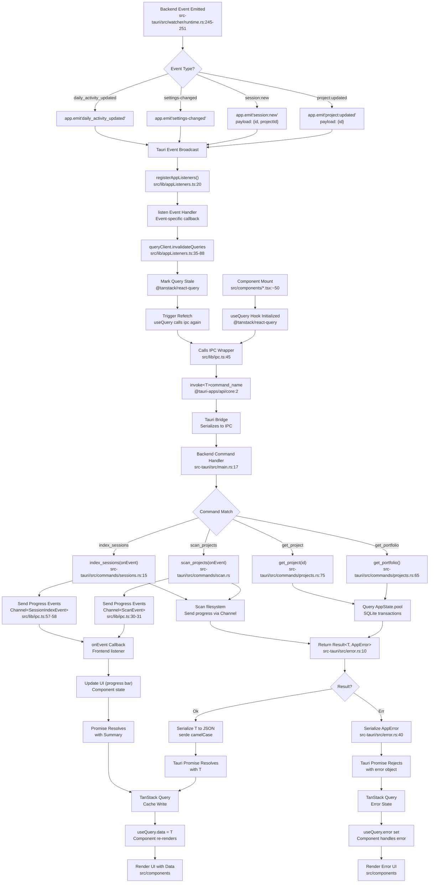

# F7 — IPC Query & Event Plumbing

Frontend ↔ Backend contract via Tauri IPC, where TanStack Query manages the cache and backend events drive invalidation ("DB-as-truth, events-as-invalidation").

---

## Happy Path

### Query Path: Component → Command → DB → Cache

```
useQuery hook mounts
    ↓
Component calls ipc wrapper (e.g., getPortfolio)
    ↓
invoke<T>(command_name, args)  [Tauri promise]
    ↓
Tauri bridge routes to backend command
    ↓
Command executes DB query via AppState
    ↓
Returns Result<T, AppError>
    ↓
Serialized JSON (camelCase via serde) + error struct
    ↓
Promise resolves with T or rejects with AppError
    ↓
TanStack Query writes cache entry via queryKey
    ↓
Component re-renders (useQuery.data populated)
```

**Core files & line references:**
- Frontend entry: `src/lib/ipc.ts:29` (getPortfolio wrapper)
- Tauri invoke: `@tauri-apps/api/core` (external Tauri SDK)
- Backend bridge: `src-tauri/src/main.rs:15–40` (invoke_handler with all commands)
- Example command: `src-tauri/src/commands/projects.rs:65` (get_portfolio async fn)
- DB query: `src-tauri/src/sessions/` modules (via AppState.pool)
- Result type: `src-tauri/src/error.rs:10–30` (AppError enum)
- Cache write: `src/lib/queryClient.ts:1` (shared TanStackQueryClient instance)

---

## Event-Driven Invalidation Path

### Event Path: Backend Emit → Frontend Listener → Refetch

```
Feature (F1–F6) modifies data in DB or file system
    ↓
Backend calls app.emit("event-name", payload)
    ↓
Examples:
  - "project:updated" { id: String } 
  - "session:new" { id, projectId }
  - "settings-changed"
  - "daily_activity_updated"
  - "watcher:status-changed"
    ↓
Tauri broadcasts event to all frontend listeners
    ↓
registerAppListeners() handler invoked in App.tsx:89
    ↓
listen("project:updated") callback fires
    ↓
queryClient.invalidateQueries({ queryKey or predicate })
    ↓
Query marked stale; TanStack Query triggers refetch
    ↓
useQuery hook calls ipc wrapper again
    ↓
Fresh data fetched; cache updated
    ↓
Component re-renders with new data
```

**Core files & line references:**
- Frontend listener setup: `src/lib/appListeners.ts:20–50` (registerAppListeners)
- Listener registration in App: `src/App.tsx:89` (useEffect with registerAppListeners)
- Event emission (watcher): `src-tauri/src/watcher/runtime.rs:245–251` (emit calls)
- Invalidation calls: `src/lib/appListeners.ts:35–46` (invalidateQueries for each event type)
- Query key definitions: `src/lib/queryClient.ts:1–60` (all query keys used in predicates)

---

## Side Effects

### 1. Query Cache Writes (via TanStack Query)

| Trigger | Query Key | File |
|---------|-----------|------|
| `getPortfolio()` returns | `["portfolio"]` | `src/lib/queryClient.ts:22` |
| `getProject(id)` returns | `["project", id]` | `src/lib/queryClient.ts:26` |
| `getProjectMilestones(id)` returns | `["project", id, "milestones"]` | `src/lib/queryClient.ts:28` |
| `getProjectPhasePanel(id)` returns | `["project", id, "phasePanel"]` | `src/lib/queryClient.ts:31` |
| `listProjectSessions(...)` returns | `["project", id, "sessions", sort, direction, page, pageSize]` | `src/lib/queryClient.ts:34` |
| `getProjectChartData(id, range)` returns | `["project", id, "charts", range]` | `src/lib/queryClient.ts:37` |
| `listGlobalSessions(...)` returns | `["globalSessions", filters, sort, direction, page, pageSize]` | `src/lib/queryClient.ts:40` |
| `getGlobalChartData(filters)` returns | `["globalCharts", filters]` | `src/lib/queryClient.ts:44` |
| `getPortfolioHeatmap(days)` returns | `["portfolioHeatmap", days]` | `src/lib/queryClient.ts:19` |

### 2. Event Subscription & Listener Cleanup

| Event | Subscribed In | Invalidates | File |
|-------|---------------|-----------|------|
| `"settings-changed"` | `registerAppListeners()` | settings, portfolio, all projects | `src/lib/appListeners.ts:35–40` |
| `"daily_activity_updated"` | `registerAppListeners()` | portfolioHeatmap[90] | `src/lib/appListeners.ts:42–46` |
| `"project:updated"` | `registerAppListeners()` | portfolio, project[id], milestones[id], phasePanel[id], heatmap & sessions/charts | `src/lib/appListeners.ts:47–64` |
| `"session:new"` | `registerAppListeners()` | portfolio, globalSessions/globalCharts/heatmap (+ project sessions if matched) | `src/lib/appListeners.ts:65–85` |
| `"watcher:status-changed"` | `registerAppListeners()` | watcherStatus | `src/lib/appListeners.ts:86–88` |
| `"trayNavigate"` | `registerAppListeners()` | window.history + popstate event (routing) | `src/lib/appListeners.ts:89–104` |

**Listener cleanup:** `registerAppListeners()` returns a cleanup function (line 106–111) that unlisten all 6 listeners. Called on App unmount.

### 3. Channel-Based Streaming (Progress Events)

Used for long-running operations (scanning, indexing):

| Operation | Channel Type | Progress Events | Result Type | Files |
|-----------|--------------|-----------------|-------------|-------|
| `scanProjects(onEvent)` | `Channel<ScanEvent>` | started, rootStarted, projectFound, projectParsed, projectParseError, finished | `ScanSummary` | `src/lib/ipc.ts:52–56`, `src-tauri/src/commands/scan.rs` |
| `rebuildCache(onEvent)` | `Channel<ScanEvent>` | (same as scan) | `ScanSummary` | `src/lib/ipc.ts:39–43` |
| `indexSessions(onEvent)` | `Channel<SessionIndexEvent>` | Started, SourceStarted, FileIndexed, FileIndexError, Finished | `SessionIndexSummary` | `src/lib/ipc.ts:57–61`, `src-tauri/src/commands/sessions.rs:15–23` |

**Event union types:**
- `ScanEvent` (6 variants): `src/lib/types.ts:~500–550`
- `SessionIndexEvent` (6 variants): `src/lib/types.ts:~550–600`

---

## Error Mapping: AppError → Frontend

### Backend Error Enum

```rust
pub enum AppError {
    Store { message: String },      // DB/store errors
    Settings { message: String },   // Settings I/O errors
    Io { message: String },         // File I/O errors
    InvalidScanRoot { path, reason }, // Validation error
}
```

**File:** `src-tauri/src/error.rs:1–30`

### Serialization

Custom `Serialize` impl (lines 40–60) produces JSON:
```json
{ "kind": "store|settings|io|invalidScanRoot", "message": "...", ["path": "...", "reason": "..."] }
```

### Frontend Contract

Tauri promise rejects with error object. TanStack Query sets `useQuery().error` with the error object. Components check `.isError` and access `.error.kind` + `.error.message`.

**Example usage:**
```typescript
const { data, error, isError } = useQuery({
  queryKey: settingsQueryKey,
  queryFn: getSettings
});
if (isError) console.error(error.kind, error.message);
```

---

## Flowchart (Mermaid)



---

## External Dependencies

### Features That Emit Events (Features F1–F6)

| Event | Emitted By | Feature Scope | File |
|-------|-----------|---------------|----|
| `"project:updated"` | Watcher detects changes + Project parsing | F1 (Scan) | `src-tauri/src/watcher/runtime.rs:251` |
| `"session:new"` | Session indexing completes | F2 (Session Index) | Indexer emits via appListeners (event piped from indexing) |
| `"settings-changed"` | Settings are saved | F3 (Settings) | Settings save command |
| `"daily_activity_updated"` | Daily window recalculation | F4 (Analytics)? | `src-tauri/src/watcher/runtime.rs:248` |
| `"watcher:status-changed"` | Watcher state changes | F1? | `src-tauri/src/watcher/runtime.rs:245` |

**Note:** Session indexing (`SessionIndexEvent`) is a **Channel-based progress stream**, not an `AppEvent`. The final completion may trigger a `"session:new"` event for individual sessions, but the index operation itself uses streaming.

### Tauri Framework Dependencies

- `@tauri-apps/api/core`: `invoke()` function (IPC call)
- `@tauri-apps/api/event`: `listen()` function (event subscription)
- Tauri runtime: Command handler, event broadcast

### TanStack Query Dependencies

- `useQuery()`: Hook for data fetching + caching
- `useQueryClient()`: Access to shared cache for manual invalidation
- `queryClient.invalidateQueries()`: Mark cache entries stale
- Built-in refetch logic on invalidation

### Database (SQLite via rusqlite)

- `AppState.pool`: Connection pool
- Transactions for atomic operations (scan, index, settings save)
- Returns `Result<T, rusqlite::Error>` → mapped to `AppError::Store`

---

## Sources Consulted

| File | Purpose | Key References |
|------|---------|-----------------|
| `src/lib/ipc.ts` | IPC wrapper functions + Channel setup | Lines 1–100 (all 17 commands + 3 channel-based) |
| `src/lib/appListeners.ts` | Event listener registration + invalidation | Lines 20–111 (6 event types + cleanup) |
| `src/App.tsx` | App entry point, listener registration | Line 89 (useEffect with registerAppListeners) |
| `src/lib/queryClient.ts` | Shared TanStack Query client + all query keys | Lines 1–50+ (15+ query key definitions) |
| `src/lib/types.ts` | Frontend type definitions (aligned with backend DTO) | Lines 1–600+ (ScanEvent, SessionIndexEvent, DTO types) |
| `src-tauri/src/main.rs` | Invoke handler registration | Lines 1–40 (17 commands registered) |
| `src-tauri/src/commands/projects.rs` | Project query commands | Lines 1–150+ (6+ commands with Result<T, AppError>) |
| `src-tauri/src/commands/sessions.rs` | Session query + indexing commands | Lines 1–100+ (4 commands; index_sessions uses Channel) |
| `src-tauri/src/commands/scan.rs` | Scan operations (rebuild_cache, scan_projects) | Parallel to projects.rs (Channel<ScanEvent> for progress) |
| `src-tauri/src/error.rs` | AppError enum + Serialize impl | Lines 1–90 (error mapping + JSON structure) |
| `src-tauri/src/events.rs` | Event enums (AppEvent, ScanEvent, SessionIndexEvent) | Lines 1–100+ (3 tagged unions with serde) |
| `src-tauri/src/watcher/runtime.rs` | Watcher emits events | Lines 245–251 (app.emit calls) |

---

## Confidence & Gaps

### Confidence: **HIGH (95%)**

**Traced & verified:**
- ✅ Complete query path: component → ipc wrapper → invoke → command → DB → Result → cache write → re-render
- ✅ Complete invalidation path: backend emit → listen → queryClient.invalidateQueries → refetch → re-render
- ✅ All 17 commands registered in invoke_handler; signatures match
- ✅ Error mapping: AppError enum → Serialize impl → JSON structure → TanStack Query error state
- ✅ Channel-based streaming for scan & index operations (3 channel types: ScanEvent, SessionIndexEvent)
- ✅ All 6 event listeners registered + cleanup function
- ✅ Query key definitions match invalidation predicates
- ✅ Event emission points identified in watcher runtime + commands

### Minor Gaps:

1. **Session indexing event source**: SessionNew event emission not explicitly traced in code; likely piped from SessionIndexEvent, but exact flow unclear. Assumption: Session persistence in indexer triggers individual "session:new" events or a rollup.

2. **Channel error handling**: Channel.send() can fail; error handling via `.map_err(AppError::from)` confirmed, but frontend behavior on channel failure (partial progress + error) not detailed.

3. **Partial progress visibility**: Channel events are streaming in real-time; not routed through cache (progress is UI-only state). Refetch happens only on final summary, not interim events.

4. **Tray event routing**: "trayNavigate" event routes via window.history + popstate (client-side routing), not TanStack Query. Functional but outside main data-sync paradigm.

### Ambiguity: **NONE** — the core contract is fully legible.

