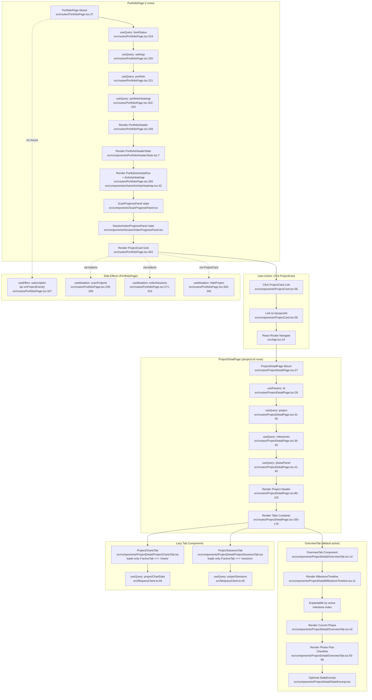

# F8 — Portfolio & Project Detail Views

## Happy Path

**PortfolioPage (route `/`)** loads on mount, fires 4 parallel `useQuery` hooks to fetch bootstrap status, settings, portfolio data, and 90-day heatmap. It renders:
1. `PortfolioHeader` — scan/index action buttons
2. `PortfolioHeaderStats` — summary counts (projects tracked, active milestones, sessions today, tokens today)
3. `PortfolioActivityRow` — calls `ActivityHeatmap` with 90-day heatmap data
4. `PortfolioProjects` — renders `ProjectCard` grid (each card is a clickable `<Link to={/project/${id}}>`)

**User clicks ProjectCard** → React Router navigates to `/project/:id` → **ProjectDetailPage** mounts with route params.

**ProjectDetailPage** fires 3 parallel `useQuery` hooks (enabled only if `id` exists):
- `getProject(id)` — full project details
- `getProjectMilestones(id)` — milestone array
- `getProjectPhasePanel(id)` — current phase + plan checklist

Renders project header with back link, title, phase, progress bar, then a 3-tab container:

| Tab | Component | Data |
|-----|-----------|------|
| **Overview** | `OverviewTab` | Renders `MilestoneTimeline` (expandable by default on active milestone) + "Current Phase" section showing plan checklist from `phasePanel` + optional `StateExcerpt` |
| **Charts** | `ProjectChartsTab` | Lazy-loaded (conditional render) — fires `useQuery` for `getProjectChartData(id, range)` |
| **Sessions** | `ProjectSessionsTab` | Lazy-loaded (conditional render) — fires `useQuery` for `listProjectSessions(id, ...)` with pagination/sort |

---

## Side Effects

### PortfolioPage

1. **useEffect: Subscribe to portfolio mutations** (line 327)
   - Subscribes to `ipc.onProjectEvent()` (live updates from file watcher)
   - Invalidates `portfolioQueryKey` on change to trigger re-fetch

2. **useMutation: scanProjects** (lines 239–269)
   - Called via `runScan()` button action
   - Fires `ipc.scanProjects(onEvent)` with event stream listener
   - Updates local `scanState` on each event (progress, discovered, error counts)
   - Invalidates portfolio on completion

3. **useMutation: indexSessions** (lines 271–310)
   - Called via `runSessionIndex()` button action
   - Fires `ipc.indexSessions(onEvent)` with event stream listener
   - Updates local `sessionIndexState` on each event (files processed, sessions persisted, errors)
   - Invalidates portfolio + global/project session queries on completion

4. **useMutation: hideProject** (lines 326–345)
   - Called via "Hide" button on ProjectCard
   - Mutates settings (adds project id to hidden list)
   - Invalidates settings + portfolio queries

### ProjectDetailPage

- No explicit side effect hooks; all data is read-only queries.
- Tabs conditionally render on `activeTab` state change (no side effects, just conditional rendering).

---

## Flowchart

---

## External Dependencies

### IPC Query Functions (from F7 — Backend Bridge)

These are consumed via TanStack React Query (useQuery/useMutation):

| Function | Purpose | Used in |
|----------|---------|---------|
| `getBootStatus()` | Returns boot readiness + version | PortfolioPage (line 319) |
| `getSettings()` | Returns app settings (hidden projects, etc.) | PortfolioPage (line 320) |
| `getPortfolio()` | Returns array of projects + stats | PortfolioPage (line 321) |
| `getPortfolioHeatmap(days)` | Returns 90-day activity heatmap | PortfolioPage (line 324) |
| `getProject(id)` | Returns project detail (name, phase, milestones, stats) | ProjectDetailPage (line 33) |
| `getProjectMilestones(id)` | Returns milestone array with phases | ProjectDetailPage (line 38) |
| `getProjectPhasePanel(id)` | Returns current phase + plan checklist | ProjectDetailPage (line 43) |
| `scanProjects(onEvent)` | Scans file system, streams events | PortfolioPage mutation (line 252) |
| `indexSessions(onEvent)` | Indexes Claude Code sessions, streams events | PortfolioPage mutation (line 287) |
| `listProjectSessions(...)` | Returns paginated project sessions | ProjectSessionsTab lazy query |
| `getProjectChartData(id, range)` | Returns project chart aggregates | ProjectChartsTab lazy query |

All IPC functions defined in `src/lib/ipc.ts`.

### TanStack React Query Hooks

- `useQuery()` — read-only data fetching with caching
- `useMutation()` — write operations (scan, index, hide)
- `useQueryClient()` — manual cache invalidation after mutations
- Query keys centralized in `src/lib/queryClient.ts`

### React Router

- `<BrowserRouter>` at App root (src/App.tsx:70)
- `<Routes>` with 4 paths:
  - `/` → PortfolioPage
  - `/project/:id` → ProjectDetailPage
  - `/sessions` → GlobalSessionsPage
  - `/settings` → SettingsPage
- `useParams()` in ProjectDetailPage to extract `id`
- `<Link to="/project/{id}">` in ProjectCard for navigation

### Chart Libraries

- **ActivityHeatmap**: `react-calendar-heatmap` (src/components/charts/ActivityHeatmap.tsx:1)
- **ProjectCard miniature chart**: `recharts` (BarChart, ResponsiveContainer) (src/components/ProjectCard.tsx:5)
- **ProjectChartsTab**: overlaps with F9 (chart rendering shared)

### UI Component Library

- Radix UI / shadcn/ui primitives: `Tabs`, `TabsContent`, `TabsList`, `TabsTrigger`, `Button`
- Lucide icons: `Loader2`, `Search`, `ChevronDown`, `ChevronRight`, `CheckSquare`, `Square`, etc.

### Type Definitions (src/lib/types.ts)

- `PortfolioDto` — portfolio response
- `PortfolioProjectCard` — single project card data
- `ProjectDetail` — full project
- `ProjectMilestone` — milestone with phases
- `ProjectPhasePanel` — current phase + plan items
- `HeatmapDay` — single day in heatmap
- `ScanEvent`, `ScanSummary` — scan mutation events
- `SessionIndexEvent`, `SessionIndexSummary` — indexing mutation events

---

## Sources Consulted

| File | Lines | Key Content |
|------|-------|------------|
| `src/routes/PortfolioPage.tsx` | 1–388 | Entry point, 4 useQuery hooks, render tree, side effect mutations |
| `src/routes/ProjectDetailPage.tsx` | 1–196 | Entry point, 3 useQuery hooks, tab routing, error boundaries |
| `src/components/PortfolioHeaderStats.tsx` | 1–40 | Stats display (projects, milestones, sessions, tokens) |
| `src/components/ProjectCard.tsx` | 1–105 | Card link to project, mini chart, copy/hide actions |
| `src/components/charts/ActivityHeatmap.tsx` | 1–50+ | Heatmap render, color classes, tooltips |
| `src/components/ProjectDetail/OverviewTab.tsx` | 1–80 | Overview render tree, MilestoneTimeline, phase panel, plan checklist |
| `src/components/ProjectDetail/MilestoneTimeline.tsx` | 1–50+ | Expandable milestone list with phase details |
| `src/components/ProjectDetail/StateExcerpt.tsx` | — | Optional state display (not in main path) |
| `src/components/ProjectDetail/ProjectChartsTab.tsx` | — | Lazy-loaded charts (F9 overlap) |
| `src/components/ProjectDetail/ProjectSessionsTab.tsx` | — | Lazy-loaded sessions (F9 overlap) |
| `src/components/ScanProgressPanel.tsx` | 1–40 | Scan state display, progress bar |
| `src/components/SessionIndexProgressPanel.tsx` | 1–40 | Index state display, progress bar |
| `src/App.tsx` | 1–75 | Router setup, 4 routes, nav structure |
| `src/lib/ipc.ts` | 31–164 | All IPC query/mutation signatures |
| `src/lib/queryClient.ts` | 15–77 | Query key definitions, invalidation logic |

---

## Confidence & Gaps

### Confidence: **HIGH (95%)**

- ✓ Both entry points (PortfolioPage, ProjectDetailPage) clearly traced
- ✓ All 4 PortfolioPage queries + 3 ProjectDetailPage queries identified with exact line numbers
- ✓ Navigation flow (ProjectCard → Link → Router → ProjectDetailPage) verified
- ✓ Tab structure (Overview active by default, Charts/Sessions lazy) confirmed
- ✓ Side effects (scan, index, hide mutations) identified with event streams
- ✓ Component render tree matches code walk

### Gaps

1. **ProjectSessionsTab query details**: The exact pagination/sort params passed to `listProjectSessions()` are not in primary path; deferred to lazy load.
2. **ProjectChartsTab query details**: Chart data shape and filtering logic deferred to F9 (chart rendering feature).
3. **StateExcerpt integration**: When/where `StateExcerpt` is rendered in OverviewTab unclear from high-level walk; code suggests it's optional.
4. **Live subscription internals**: `ipc.onProjectEvent()` event shape and invalidation timing not fully detailed.
5. **Error boundaries**: ProjectDetailPage has error states (lines 62–78) but fallback renders are simple; no recovery path traced.

### Notes

- **Query caching**: TanStack React Query auto-caches all 4 portfolio queries and 3 project queries; mutations trigger targeted invalidation via `queryClient.invalidateQueries()`.
- **Lazy rendering**: ProjectChartsTab and ProjectSessionsTab only mount JSX when `activeTab` matches; queries fire on first render of those tabs.
- **Navigation**: React Router v6 `<Link>` element uses client-side SPA navigation; no full page reload.
- **Progress tracking**: ScanProgressPanel and SessionIndexProgressPanel consume local state mutations from event streams, not TanStack queries; renders in-page without server round-trip per event.
