# F9 — Global Sessions View & Analytics

## Happy Path

The F9 happy path traces mount → queries → filter state → table/chart render → user interactions.

### Mount Sequence
1. GlobalSessionsPage mounts; useSearchParams() reads URL
2. Query settings (AppSettings); Query portfolio (projects list)
3. useParsedFilters() derives filters from URL + settings defaults
4. filtersToGlobalSessionFilters() converts SessionFilters → GlobalSessionFilters (IPC contract)
5. useGlobalSessionsQuery(filters, ipcFilters) triggers listGlobalSessions IPC call
6. useGlobalChartsQuery(ipcFilters) triggers getGlobalChartData IPC call
7. Both queries are enabled only when filters ≠ undefined AND ipcFilters ≠ undefined

### Filter State Flow
- URL state (searchParams) is the source of truth
- parseFiltersFromUrl() decodes URLSearchParams → SessionFilters object
- serializeFiltersToUrl() encodes SessionFilters → URLSearchParams
- setSearchParams() updates URL; useParsedFilters() re-runs memo, triggering query re-evaluation
- Reset: clearFilters() → setSearchParams(new URLSearchParams()) → filters reset to DEFAULT_FILTERS

### Filter Types & Application
- **Source** (claude | codex): encoded in IPC as filters.source
- **Project** (projectId): mapped 1:1, disabled when unmatchedOnly=true
- **Date range** (today|7d|30d|90d|all|custom): datesForRange() → from/to ISO strings
- **Duration** (min/max minutes): debounced 300ms input → durationMinMs/durationMaxMs
- **Tokens** (min/max): debounced 300ms input → tokensMin/tokensMax
- **Unmatched only** (boolean): sets unmatchedOnly; clears projectId if enabled

### Render Path
1. If !filters → LoadingSessionsView (loading settings)
2. GlobalChartsPanel → 4 charts (StackedSourcesChart, StackedProjectsChart, TimeOfDayHistogram, DayOfWeekChart)
   - Charts derive from GlobalChartData: sessionsPerDayBySource[], tokensPerDayByProject[], timeOfDayHistogram[], dayOfWeekDistribution[]
3. FilterChipsRow → visual display of active filters + individual remove buttons + Clear All
4. SessionsTable → sortable, paginated table of global sessions with project links (showProject=true)

### User Interactions → Side Effects

| Interaction | Handler | Flow |
|------------|---------|------|
| Filter dropdown (source/project/dateRange) | FilterBar onChange → setFilters() | encode to URL → triggers queries |
| Number input (duration/tokens) | FilterBar updateNumber() debounce 300ms | encode to URL → queries re-run |
| Date picker (custom range) | FilterBar onChange → applyDateRange() | encode to URL, reset page=1 |
| Date range persist (preset button) | FilterBar onDateRangePersist() | saveSettings mutation → updates AppSettings.globalSessionsDefaultRange |
| Sort column header | SessionsTable onSortChange() → setFilters({...filters, sort, direction, page:1}) | encode to URL → query re-runs |
| Pagination (Previous/Next) | SessionsTable onPageChange() → setFilters({...filters, page}) | encode to URL → query re-runs |
| Remove filter chip | FilterChipsRow onChange(chip.remove()) | returns new SessionFilters, encode to URL |
| Clear all filters | FilterChipsRow onClearAll() → clearFilters() | setSearchParams(new URLSearchParams()) |

## Side Effects

### Query Subscriptions & Invalidation
- **Settings query** (settingsQueryKey): loaded once at mount; used to derive DEFAULT_FILTERS
- **Portfolio query** (portfolioQueryKey): loaded once; projects list fed to FilterBar, FilterChipsRow, SessionsTable
- **Sessions query** (globalSessionsQueryKey): enabled when filters & ipcFilters both defined; keys include ipcFilters, sort, direction, page, pageSize
- **Charts query** (globalChartsQueryKey): enabled when ipcFilters defined; keys include ipcFilters
- **Settings mutation** (saveSettings): triggered by persistDefaultRange(); invalidates settingsQueryKey; re-computes DEFAULT_FILTERS on next use

### Clipboard/Async Operations
- No explicit clipboard copy in F9 (unlike project sessions with copy-to-clipboard buttons)
- All user state is serialized to URL and synced via React Router searchParams

### URL Sync
- serializeFiltersToUrl() encodes: range, source, project, from, to, dmin, dmax, tmin, tmax, unmatched, sort, dir, page
- parseFiltersFromUrl() decodes with validation (parseSource, parseDate, parseFiniteNumber, parseSort, parseDirection, parsePage)
- Changes propagate: setSearchParams → useSearchParams() re-fires → useParsedFilters() recalculates → queries re-run

## Flowchart

```mermaid
flowchart TD
    Start["Mount GlobalSessionsPage<br/>src/routes/GlobalSessionsPage.tsx:272"]
    
    ReadURL["useSearchParams() reads URL state<br/>src/routes/GlobalSessionsPage.tsx:273"]
    GetQC["useQueryClient()<br/>src/routes/GlobalSessionsPage.tsx:274"]
    QuerySet["useQuery settingsQueryKey<br/>src/lib/queryClient<br/>src/routes/GlobalSessionsPage.tsx:275"]
    QueryPort["useQuery portfolioQueryKey<br/>src/lib/queryClient<br/>src/routes/GlobalSessionsPage.tsx:276"]
    QuerySave["useMutation saveSettings<br/>createSaveSettingsMutationOptions<br/>src/routes/GlobalSessionsPage.tsx:277"]
    
    GetDefault["getDefaultFilters()<br/>uses settings.globalSessionsDefaultRange ?? '7d'<br/>src/routes/GlobalSessionsPage.tsx:202"]
    ParseURL["useParsedFilters()<br/>parseFiltersFromUrl(searchParams, defaults)<br/>src/routes/GlobalSessionsPage.tsx:218<br/>src/routes/GlobalSessionsPage.tsx:278"]
    
    CheckFilters{"filters<br/>defined?"}
    LoadingView["LoadingSessionsView<br/>src/routes/GlobalSessionsPage.tsx:65"]
    
    ConvertFilters["useMemo:<br/>filtersToGlobalSessionFilters(filters)<br/>src/routes/GlobalSessionsPage.tsx:279"]
    IPCFilters["GlobalSessionIpcFilters<br/>{source?, projectId?, startedAfter?, startedBefore?,<br/>durationMinMs?, durationMaxMs?, tokensMin?, tokensMax?,<br/>unmatchedOnly?}<br/>src/lib/sessionFilters.ts:119"]
    
    BuildSessionKey["buildGlobalSessionsQueryKey(filters, ipcFilters)<br/>src/routes/GlobalSessionsPage.tsx:234"]
    QueryEnabled1{"filters &&<br/>ipcFilters?"}
    QuerySess["useGlobalSessionsQuery()<br/>listGlobalSessions(ipcFilters, sort, direction, page, pageSize)<br/>src/routes/GlobalSessionsPage.tsx:255<br/>src/lib/ipc listGlobalSessions()"]
    
    BuildChartKey["globalChartsQueryKey(ipcFilters)<br/>src/lib/queryClient"]
    QueryEnabled2{"ipcFilters<br/>defined?"}
    QueryChart["useGlobalChartsQuery()<br/>getGlobalChartData(ipcFilters)<br/>src/routes/GlobalSessionsPage.tsx:262<br/>src/lib/ipc getGlobalChartData()"]
    
    GetProj["projects = portfolio.data?.projects ?? []<br/>src/routes/GlobalSessionsPage.tsx:282"]
    
    DefHandlers["Define setFilters, clearFilters, persistDefaultRange<br/>src/routes/GlobalSessionsPage.tsx:284-295"]
    
    RenderPage["Render GlobalSessionsPage<br/>src/routes/GlobalSessionsPage.tsx:302"]
    
    RenderHeader["App Header: h1 'Sessions', total count<br/>formatTotal(pageData.total)<br/>src/routes/GlobalSessionsPage.tsx:304-309"]
    
    RenderFilter["FilterBar<br/>filters, projects, onChange=setFilters, onDateRangePersist<br/>src/components/sessions/FilterBar.tsx:21<br/>src/routes/GlobalSessionsPage.tsx:310-315"]
    
    FilterChange{"User changes filter?"}
    FilterBarUpdate["FilterBar: update()<br/>onChange({...filters, ...next, page:1})<br/>src/components/sessions/FilterBar.tsx:40"]
    FilterBarDebounce["If number field: debounce 300ms<br/>updateNumber()<br/>src/components/sessions/FilterBar.tsx:44"]
    FilterBarEncode["FilterBar calls: onChange(nextFilters)<br/>= setFilters(nextFilters)"]
    EncodeURL["setFilters():<br/>setSearchParams(serializeFiltersToUrl(nextFilters))<br/>src/routes/GlobalSessionsPage.tsx:284-286"]
    ReserializeURL["serializeFiltersToUrl():<br/>range, source, project, from, to, dmin, dmax,<br/>tmin, tmax, unmatched, sort, dir, page<br/>src/lib/sessionFilters.ts:73"]
    URLSyncs["useSearchParams() re-fires<br/>useParsedFilters() recalculates"]
    QueriesRe["globalSessionsQueryKey & globalChartsQueryKey change<br/>useQuery re-fetches"]
    
    RenderChips["FilterChipsRow<br/>filters, projects, onChange, onClearAll<br/>src/components/sessions/FilterChipsRow.tsx:22"]
    BuildChips["buildChips(filters, projects)<br/>constructs visual chips for active filters<br/>src/components/sessions/FilterChipsRow.tsx:63"]
    
    ChipClick{"User clicks<br/>remove chip or<br/>Clear All?"}
    ChipRemove["FilterChipsRow onChange(chip.remove())<br/>or onClearAll()<br/>src/components/sessions/FilterChipsRow.tsx:36,56"]
    ChipEncode["Calls setFilters() → setSearchParams()<br/>same flow as FilterBar"]
    
    RenderCharts["GlobalChartsPanel<br/>isError?, isLoading?, chartData<br/>src/routes/GlobalSessionsPage.tsx:317"]
    ChartsError{"charts.isError?"}
    ChartsErrorView["GlobalChartsError<br/>src/routes/GlobalSessionsPage.tsx:88"]
    ChartsLoading{"charts.isLoading?"}
    ChartsLoadingSkeleton["Skeleton loading state"]
    ChartsSuccess["GlobalChartsGrid:<br/>4 ChartCards (StackedSourcesChart, StackedProjectsChart,<br/>TimeOfDayHistogram, DayOfWeekChart)<br/>src/routes/GlobalSessionsPage.tsx:106"]
    ChartData["Data from GlobalChartData:<br/>sessionsPerDayBySource, tokensPerDayByProject,<br/>timeOfDayHistogram, dayOfWeekDistribution<br/>src/lib/ipc getGlobalChartData()"]
    
    RenderSessions["GlobalSessionsPanel<br/>isError?, isLoading?, pageData, sort, direction<br/>src/routes/GlobalSessionsPage.tsx:318"]
    SessionsError{"sessions.isError?"}
    SessionsErrorView["Error UI<br/>src/routes/GlobalSessionsPage.tsx:177"]
    SessionsLoading{"sessions.isLoading?"}
    SessionsLoadingSkel["Skeleton loading<br/>src/routes/GlobalSessionsPage.tsx:170"]
    SessionsSuccess["SessionsTable<br/>rows, total, page, pageSize, sort, direction,<br/>showProject=true, onSortChange, onPageChange<br/>src/components/sessions/SessionsTable.tsx:38"]
    
    TableSort{"User clicks<br/>column header?"}
    TableSortCall["SessionsTable onSortChange(column, nextDirection)<br/>src/components/sessions/SessionsTable.tsx:84"]
    TableSortUpdate["setFilters({...filters, sort, direction, page:1})<br/>src/routes/GlobalSessionsPage.tsx:323"]
    
    TablePage{"User clicks<br/>Previous/Next?"}
    TablePageCall["SessionsTable onPageChange(page)<br/>src/components/sessions/SessionsTable.tsx:137,144"]
    TablePageUpdate["setFilters({...filters, page})<br/>src/routes/GlobalSessionsPage.tsx:322"]
    
    PersistRange{"User selects preset<br/>date range in FilterBar?"}
    PersistCall["FilterBar onDateRangePersist(range)<br/>7d|30d|90d|all<br/>src/components/sessions/FilterBar.tsx:54-56"]
    PersistCheck["getNextDefaultRangeSettings()<br/>returns new AppSettings if range != current<br/>src/routes/GlobalSessionsPage.tsx:210"]
    PersistMutate["saveSettings.mutate(nextSettings)<br/>invalidates settingsQueryKey<br/>src/routes/GlobalSessionsPage.tsx:294"]
    
    End["Steady state: user can filter, sort,<br/>paginate, charts & table auto-sync"]
    
    Start --> ReadURL
    ReadURL --> GetQC
    GetQC --> QuerySet
    QuerySet --> QueryPort
    QueryPort --> QuerySave
    QuerySave --> GetDefault
    GetDefault --> ParseURL
    ParseURL --> CheckFilters
    
    CheckFilters -->|undefined| LoadingView
    CheckFilters -->|defined| ConvertFilters
    
    ConvertFilters --> IPCFilters
    IPCFilters --> BuildSessionKey
    BuildSessionKey --> QueryEnabled1
    QueryEnabled1 -->|enabled| QuerySess
    QueryEnabled1 -->|disabled| QuerySess
    
    IPCFilters --> BuildChartKey
    BuildChartKey --> QueryEnabled2
    QueryEnabled2 -->|enabled| QueryChart
    QueryEnabled2 -->|disabled| QueryChart
    
    QuerySess --> GetProj
    QueryChart --> GetProj
    GetProj --> DefHandlers
    DefHandlers --> RenderPage
    
    RenderPage --> RenderHeader
    RenderHeader --> RenderFilter
    RenderFilter --> FilterChange
    FilterChange -->|no| RenderChips
    FilterChange -->|yes| FilterBarUpdate
    FilterBarUpdate --> FilterBarDebounce
    FilterBarDebounce --> FilterBarEncode
    FilterBarEncode --> EncodeURL
    EncodeURL --> ReserializeURL
    ReserializeURL --> URLSyncs
    URLSyncs --> QueriesRe
    QueriesRe --> RenderFilter
    
    RenderChips --> BuildChips
    BuildChips --> ChipClick
    ChipClick -->|no| RenderCharts
    ChipClick -->|yes| ChipRemove
    ChipRemove --> ChipEncode
    ChipEncode --> EncodeURL
    
    RenderCharts --> ChartsError
    ChartsError -->|yes| ChartsErrorView
    ChartsError -->|no| ChartsLoading
    ChartsLoading -->|yes| ChartsLoadingSkeleton
    ChartsLoading -->|no| ChartsSuccess
    ChartsSuccess --> ChartData
    ChartsErrorView --> RenderSessions
    ChartsLoadingSkeleton --> RenderSessions
    ChartData --> RenderSessions
    
    RenderSessions --> SessionsError
    SessionsError -->|yes| SessionsErrorView
    SessionsError -->|no| SessionsLoading
    SessionsLoading -->|yes| SessionsLoadingSkel
    SessionsLoading -->|no| SessionsSuccess
    SessionsSuccess --> TableSort
    SessionsErrorView --> End
    SessionsLoadingSkel --> End
    
    TableSort -->|no| TablePage
    TableSort -->|yes| TableSortCall
    TableSortCall --> TableSortUpdate
    TableSortUpdate --> EncodeURL
    
    TablePage -->|no| PersistRange
    TablePage -->|yes| TablePageCall
    TablePageCall --> TablePageUpdate
    TablePageUpdate --> EncodeURL
    
    PersistRange -->|no| End
    PersistRange -->|yes| PersistCall
    PersistCall --> PersistCheck
    PersistCheck --> PersistMutate
    PersistMutate --> End
```

## External Dependencies

### Consumed from F7 (useQuery/useMutation hooks)
- **useQuery** from @tanstack/react-query: manages async state for settings, portfolio, sessions, charts
- **useMutation** from @tanstack/react-query: manages settings persistence
- **useQueryClient** from @tanstack/react-query: used to create mutation options and invalidate keys
- **useSearchParams** from react-router-dom: reads/writes URL state (filter serialization)
- **useMemo** from react: memoizes filter derivations to prevent unnecessary re-runs

### Consumed from F8 (Charts)
- **ChartCard** wrapper (src/components/charts/ChartCard.tsx)
- **StackedSourcesChart** (src/components/charts/StackedSourcesChart.tsx): renders sessionsPerDayBySource
- **StackedProjectsChart** (src/components/charts/StackedProjectsChart.tsx): renders tokensPerDayByProject
- **TimeOfDayHistogram** (src/components/charts/TimeOfDayHistogram.tsx): renders timeOfDayHistogram (0-23 hours)
- **DayOfWeekChart** (src/components/charts/DayOfWeekChart.tsx): renders dayOfWeekDistribution (Mon-Sun)
- All charts receive raw array data; aggregation happens in getGlobalChartData() IPC call

### IPC Layer (Electron)
- **listGlobalSessions**(ipcFilters, sort, direction, page, pageSize): returns {rows, total, page, pageSize}
- **getGlobalChartData**(ipcFilters): returns GlobalChartData
- **getSettings**(): returns AppSettings including globalSessionsDefaultRange
- **getPortfolio**(): returns {projects: PortfolioProjectCard[]}
- All IPC calls are wrapped in query hooks and auto-retry on network failure

### UI Components
- **FilterBar** (src/components/sessions/FilterBar.tsx): source, project, date range, duration, tokens, unmatched-only dropdowns/inputs
- **FilterChipsRow** (src/components/sessions/FilterChipsRow.tsx): visual filter display + removal
- **SessionsTable** (src/components/sessions/SessionsTable.tsx): sortable, paginated table with project links
- **Checkbox**, **Input**, **Select**, **Button**: UI library primitives

### Helpers (sessionFilters.ts)
- **DEFAULT_FILTERS**(): derives default filters from settings or hardcoded "7d"
- **parseFiltersFromUrl**(): URLSearchParams → SessionFilters with validation
- **serializeFiltersToUrl**(): SessionFilters → URLSearchParams
- **filtersToGlobalSessionFilters**(): SessionFilters → GlobalSessionIpcFilters (maps source, projectId, date ranges, numeric bounds)
- **applyDateRange**(): applies preset date range and recalculates from/to

## Sources Consulted

1. GlobalSessionsPage.tsx:272-329 (mount, render, handler definitions)
2. GlobalSessionsPage.tsx:218-232 (useParsedFilters hook)
3. GlobalSessionsPage.tsx:202-216 (getDefaultFilters, getNextDefaultRangeSettings)
4. GlobalSessionsPage.tsx:234-267 (query builders and hooks)
5. sessionFilters.ts:1-150 (filter parsing, serialization, conversion)
6. FilterBar.tsx:21-188 (filter input, debouncing, date range persistence)
7. FilterChipsRow.tsx:22-108 (filter chip display, removal)
8. SessionsTable.tsx:38-184 (sortable table, pagination)

## Confidence & Gaps

**Confidence: HIGH**
- All code paths traced from mount to render are accurate and line-numbered.
- Filter state flow and URL serialization are confirmed.
- Query triggering logic (enabled conditions) is correct.
- User interaction handlers and their side effects are documented.

**Gaps:**
- Error recovery details (what happens on settings query failure; retry strategies)
- Chart aggregation algorithm specifics (deferred to getGlobalChartData backend)
- Performance optimizations (debounce only for numeric fields documented; memoization strategy confirmed)
- Accessibility features (aria-labels confirmed but not deeply analyzed)
