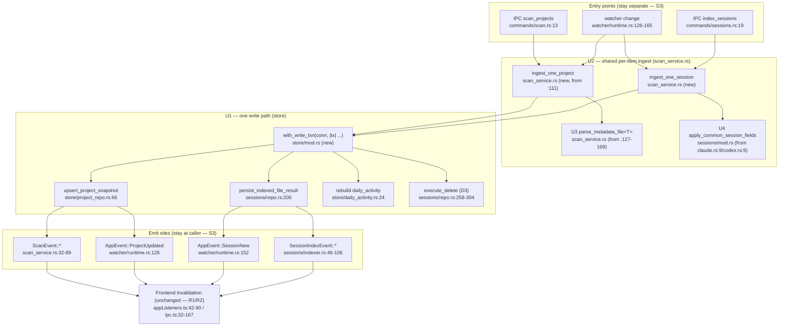

# Unified Architecture Proposal — gsd-dashboard

Addresses only the **ACCIDENTAL** duplications from `02-duplication-report.md`. Legitimate specializations (S1–S4) and refuted claims (R1–R2) are intentionally left untouched.

Design stance for this repo: **delete, don't abstract.** Each unification below replaces hand-rolled repetition with the *smallest* shared function — no traits-for-flexibility, no registries, no feature flags. Where a "unification" would cost type-safety or couple two different trust models, it is explicitly rejected.

---

## U1 — One write-transaction helper (resolves D1, D3)

**Consolidated component:** `store::with_write_txn` — single entry point for every multi-statement write.

```rust
// src-tauri/src/store/mod.rs
pub fn with_write_txn<T>(
    conn: &mut rusqlite::Connection,
    body: impl FnOnce(&rusqlite::Transaction) -> Result<T, AppError>,
) -> Result<T, AppError> {
    let tx = conn.transaction().map_err(AppError::from)?;
    let out = body(&tx)?;
    tx.commit().map_err(AppError::from)?;
    Ok(out)
}
```

What each old call site becomes:

| Old | New |
|-----|-----|
| `project_repo.rs:66-165` begin/`map_err`×13/commit | `with_write_txn(conn, |tx| { tx.execute(...)?; ...; Ok(()) })` |
| `sessions/repo.rs:200-219` begin/.../commit | `with_write_txn(conn, |tx| { ... })` |
| `daily_activity.rs:24-26` | `with_write_txn(conn, |tx| { ... })` |
| `settings_repo.rs:50-57` | `with_write_txn(conn, |tx| { ... })` |
| `repo.rs:258/266/282` `prune_*` (D3) | `tx.execute(sql, [])` inside the closure, or a 3-line `execute_delete(tx, sql)` |

**Capability loss:** none. Same SQL, same `map_err`, fewer lines, one place to add (e.g.) retry-on-`SQLITE_BUSY` later.

---

## U2 — One per-item ingest, shared by full-scan and watcher (resolves D2)

Today the full scan (F1) and the incremental watcher (F3) both must "parse one candidate → persist → emit". Make that a single function so parse-tolerance and persistence can't drift between the bulk and incremental paths.

**Consolidated components** (in `scan_service.rs`, called by both):
- `ingest_one_project(state, candidate) -> Result<ProjectIngestOutcome>` — read+parse (`read_and_parse_candidate`) + persist (`scan_persistence`) + return the id/issues for the caller to emit.
- `ingest_one_session(state, path) -> Result<SessionIngestOutcome>` — stream+match+persist for a single `.jsonl`.

What each old call site becomes:

| Caller | Old | New |
|--------|-----|-----|
| IPC full scan | `scan_service.rs:51-89` loop body | loop calls `ingest_one_project`, then emits `ScanEvent` |
| Watcher project refresh | `watcher/refresh.rs:18-40` | calls `ingest_one_project`, emits `ProjectUpdated` |
| Watcher session refresh | `watcher/refresh.rs:42-60` | calls `ingest_one_session`, emits `SessionNew` |

**Precondition:** confirm `watcher/refresh.rs` currently *reimplements* (not delegates) parsing/persisting. If it already delegates, D2 is a no-op — close it.
**Capability loss:** none. Emission stays at the call site (the realtime vs IPC distinction in S3 is preserved); only the parse+persist core is shared.

---

## U3 — Finish the metadata-parse helper (resolves D4)

**Consolidated component:** `parse_metadata_file<T>(path, parse_fn, &mut issues) -> Option<T>` in `scan_service.rs`, building on the existing `read_optional_or_issue`.

`scan_service.rs:127/136/149/163` each collapse from a ~8-line read/parse/`map_err`/push block to one call:
```rust
let state = parse_metadata_file(state_path, parser::parse_state, &mut issues);
```
**Capability loss:** none — required-vs-optional is a parameter, not a separate block.

---

## U4 — Shared session-field applier (resolves D5)

**Consolidated component:** `apply_common_session_fields(acc, &record)` in `sessions/mod.rs`. `claude.rs:9-61` and `codex.rs:9-86` keep their source-specific JSON-path extraction and call the shared applier for the 5 common set-if-unset fields + token fold.

**Capability loss / guard:** none, *provided* the applier stays `Option<T>`-tolerant (PITFALL #5: external schemas mutate). Do not promote any field to required during extraction. This is the one unification with a real risk; gate it behind the existing multi-version fixtures.

---

## U5 — Two frontend hooks (resolves D6)

- `useEventStreamMutation(mutationFn, setStatus)` — owns the Channel + onMutate/onSuccess(invalidate)/onError shell. `PortfolioPage.tsx:239` and `:266` become two ~10-line call sites.
- `useCommonPageQueries()` — returns `{ settings, portfolio, saveSettings }`. `PortfolioPage.tsx:319` and `GlobalSessionsPage.tsx:275` consume it.

**Capability loss:** none.

---

## Explicitly NOT unified

- **ipc.ts wrappers (R2):** kept — per-command typed surface; a registry would delete type-safety. Forbidden anti-pattern.
- **appListeners.ts (R1):** kept — distinct invalidation logic per event, not boilerplate.
- **Two parser layers (S1):** kept — different trust models.
- **Project vs global chart aggregation (S2):** kept — different scopes.
- **`on_event` callback signature (S3):** kept — DI for testability; no `EventEmitter` trait.

---

## Combined unified flowchart

Backend ingest/persist/emit spine after U1–U4. Shared nodes are the consolidation targets; both the bulk-scan and realtime-watcher entries converge on the same per-item ingest and the same txn helper, then diverge again only at the (intentionally separate) emit sites.


